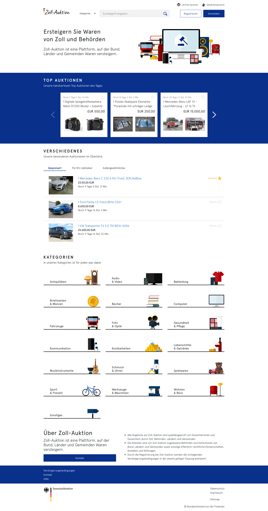
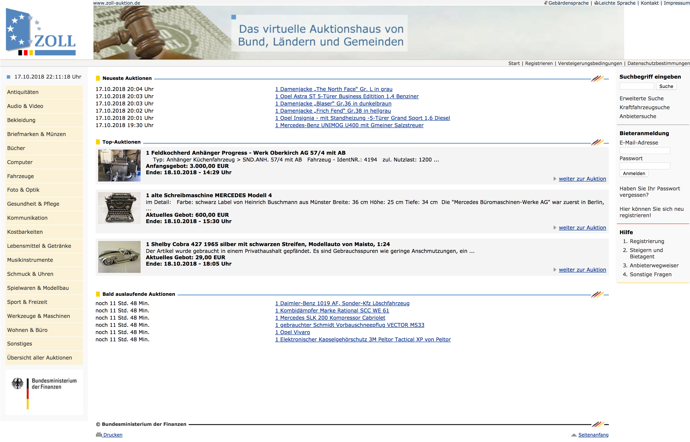

# Zoll-Auktion.de

> _Online ersteigern_ Das virtuelle Auktionshaus der öffentlichen Verwaltung - Von der Münzsammlung bis zum Feuerwehrauto: Auf zoll-auktion.de gibt es fast nichts, was es nicht gibt – und für jeden etwas. Im Internet versteigern Bund, Länder und Gemeinden gepfändete, ausrangierte oder gefundene Stücke.

Im Rahmen des Fellowships _Tech4Germany_ 2018 wurde die Website [zoll-auktion.de](https://zoll-auktion.de/) (2017: Umsatz von rund 85.000.000 Euro - [Quelle](https://www.nw.de/nachrichten/wirtschaft/21943183_Ausrangiert-oder-beschlagnahmt-Zoll-Auktion-bringt-dem-Staat-Millionen.html)) einem Redesign unterzogen. Nach ausführlicher UX-Research und agilen, iterativen Designprozessen, wurde die Website in Form von HTML, CSS entwickelt und ein dazugehöriger Styleguide erstellt.

## Template Preview

`index.html` oder andere `.html`-Dateien im Browser aufrufen

## Entwicklung

### Minimale Requirements

- [Node](https://nodejs.org) v10.11.0+ inklusive `npm` installieren
- [Gulp](https://gulpjs.com/)
  - gulp-cli v2.0.1+ mit `npm install gulp-cli -g` global installieren
  - gulp mit `npm install gulp -D` global installieren
- [VuePress](https://vuepress.vuejs.org/) für den Styleguide installieren
  - `npm install -g vuepress` global installieren

### Setup für Entwicklung

- Repository clonen
- Minimalen Requirements nachkommen
- `npm install` im zoll-auktion.de Ordner ausführen, damit alle Dependencies installiert werden
- `gulp` ausführen um SASS zu CSS zu kompilieren und [BrowserSync](https://browsersync.io/docs/gulp) zu starten
- _neue Dependencies können mit `npm install --save-dev <neueDependency>` hinzugefügt werden_
- `npm run docs:dev` ausführen um den Styleguide im Entwicklermodus zu starten, auf `localhost:8080` kann der Styleguide dann aufgerufen werden

### Styleguide builden
- in `config.js`, die `base` Variable muss anders gesetzt werden, jenachdem wo man die Seite anzeigen lassen möchte:
    - auf einer Hauptdomain und in Entwicklermodus : kein `base` nötig bzw. leer lassen
    - offline in Produktionmodus von einer lokalen Pfad `base: './'`
    - auf einer Subdomain: `base: '/<REPO>/'`
- `npm run docs:dev` ausführen, um den Styleguide im Developmentmodus zu starten und dann `localhost:8080` aufrufen
- `npm run docs:build` ausführen, um den Styleguide für Production zu bauen
    - mit `python -m SimpleHTTPServer` im Ordner `docs/.vuepress/dist/` kann der Styleguide statisch besucht werden

## Aufbau

- 4 HTML Seitenansichten sind via `index.html` ansteuerbar
- SASS Dateien sind im Ordner `scss/`
- eigene JS Dateien sind im Ordner `js/` 
- NoUISlider ist im Ordner `nouislider/` 
- Slick Dateien mit umgeschriebener JS Datei ist im Ordner `slick/` 
- Illustrationen und weitere Assets sind im Ordner `assets/` 
- minimized CSS wird in den Ordner `css/` gelegt (identisches aber nicht minimized CSS in den Ordner `dist/`)
- der Styleguide befindet sich im `docs/` Ordner
    - wenn via `npm run docs:build` der Styleguide statisch gebaut wird, werden die Dateien in den `docs/.vuepress/dist` Pfad abgelegt

## Dependencies

- [Bootstrap](http://getbootstrap.com/) v4.1.3+
- [jQuery](https://jquery.com/) v3.3.1+
- [slick](http://kenwheeler.github.io/slick/) v1.8.1+
- [noUiSlider](https://refreshless.com/nouislider/) v12.0.0

## Weiterführende Links

- Flexbox
  - http://getbootstrap.com/docs/4.1/layout/grid/
  - https://css-tricks.com/snippets/css/a-guide-to-flexbox/
- SASS
  - https://sass-lang.com/guide
  
## Aktueller (17.10.2018) Webauftritt (mit noch _altem_ Design)

## Team

- Andreas Ellwanger
- Ahmad Moudallal
- Lisa Schmechel
- Marietta Herzog

## Illustrationen

- Marietta Herzog
  
  
