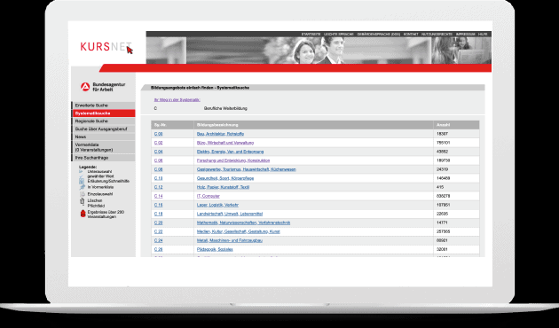
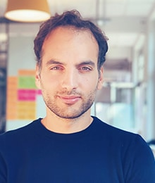
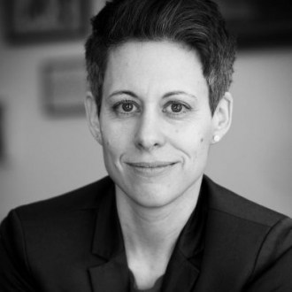

# **Projekt Weiterbildungsportal BMAS 2019**

In diesem Projekt haben wir uns im Sinne der nationalen Weiterbildungsstrategie mit der Herausforderung beschäftigt, wie Menschen in Deutschland die für sie richtige Weiterbildung finden können. Entstanden ist eine zentrale Plattform, die die wichtigsten User Needs abdeckt.

### [Case Study](https://medium.com/tech4germany/fallstudie-weiterbildung-einstiegsplattform-f%C3%BCr-weiterbildung-b7455b47161b)

# Herausforderung

Die nationale Weiterbildungsstrategie legt eine Plattform zum Thema Weiterbildung fest, die Menschen in Deutschland befähigen soll, richtige und mehr Weiterbildungsangebote in Anspruch zu nehmen.

# Zielsetzung

Wir helfen Menschen durch das Labyrinth der Weiterbildungssuche, indem wir alle Informationen zur Weiterbildung auf einer Plattform bündeln und eine spielerische Möglichkeit zur Orientierung bieten. Mit unserer Plattform ermöglichen wir ein „Lebenslanges Lernen“.

Spielerische Orientierung im Weiterbildungs-Labyrinth durch Machine Learning.

Finden der richtigen Weiterbildung durch erhöhte Informationstransparenz

Finanzieren der Weiterbildung dank des integrierten Förder-Rechners

### Galerie

# Unsere Ergebnisse sind frei verfügbar

## Dokumentation

Gesamtkonzept einer Einstiegsplattform für Weiterbildungsangebote.

### [Download](f1_BMAS_Weiterbildung-Projektdokumentation_T4GWebseite.pdf)

## Technischer Prototyp

Prototyp eines Orientierungstools, das spielerisch Berufsfelder und passende Weiterbildungsangebote aufzeigt.

### [Link](http://t4g-2019-bmas.s3-website.us-east-2.amazonaws.com/) 

## Source-Code

Übergabe des Source-Codes für das Machine-Learning gestützte Orientierungstool für Weiterbildungsangebote

### [Link](https://github.com/tech4germany/Tech4Germany-Weiterbildung)

# Projektteam

|                         |                        |
|:-----------------------:|:----------------------:|
|  **Natalie Bosch** Product Fellow |  **Pablo Abbis** Product Fellow |
|  **Manuel Lang** Engineering Fellow |  **Florian Zechmeister** Engineering Fellow | 

### Projektpartner:innen

BMAS

|                         |                        |
|:-----------------------:|:----------------------:|
|  **Michael Schulze** Digitallotse |  **Julia Borggräfe** Projektleiterin | 

