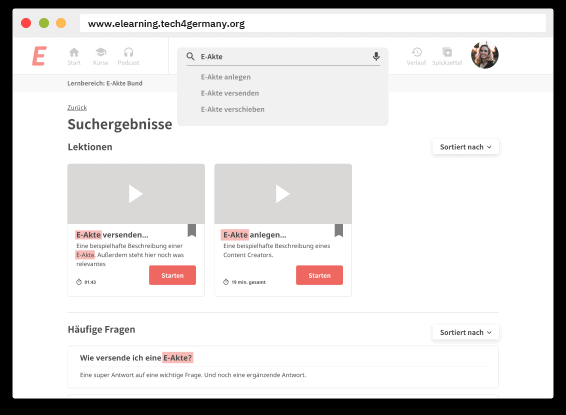

# **e-Learning ITZ Bund 2019**

Die IT-Konsolidierung des Bundes bringt einen enormen Schulungsaufwand mit sich. Um allen Mitarbeiter:innen der Verwaltung einen reibungslosen Umstieg zu gewähren sollte E-Learning als wertvolle Chance genutzt werden.

### [Case Study](https://medium.com/tech4germany/fallstudie-e-learning-e-learning-zur-e-akte-bund-dad91e49d1dc)

# Herausforderung

Ab 2020 wird flächendeckend in allen Behörden die E-Akte eingeführt, die den Umgang mit der Papierakte abschafft. Eine enorme Umstellung für die Mitarbeiter:innen der deutschen Verwaltung. Die E-Akte ist nur eine von 41 Services, die im Rahmen der IT-Konsolidierung eingeführt werden.

Mit einer E-Learning Lösung soll der geschätzte Schulungsaufwand von 750.000 Personentagen reduziert und die Qualität der Schulungen durch Individualisierung gesteigert werden.

# Zielsetzung

Damit für das Thema E-Learning im Bund die Wege bereitet werden, bereiten wir eine direkte Übergabe an die Mitarbeitenden im ITZBund vor und geben Handlungsempfehlungen mit auf den Weg.

Ein erster Prototyp zur Veranschaulichung der Vision einer E-Learning Plattform im Bund

Gezielte Ansprache unteschiedlicher Lerntypen durch eine entsprechende Strategie

Intensiver Austausch zur Verwirklichung der E-Learning Vision im weiteren Verlauf

# Startseite

Die Startseite soll Nutzer:innen in ihrer Lernerfahrung bestärken. Begonnene Kurse können hier jederzeit fortgesetzt werden. Eine Anlaufstelle für Hilfesuchende ist deutlich sichtbar.

# Kurse

Die Kursseiten bieten die Möglichkeit Anhänge & Vorlagen direkt runterzuladen und inhaltliche Fragen zu stellen.

# Direkte Suche

Auch punktuelle Lerner kommen mit einer erweiterten Suche auf ihre Kosten und können Wissen erfahren ohne ganze Kurse oder Lektionen zu schauen.

# Unsere Ergebnisse sind frei verfügbar

## Executive Summary

Executive Summary der Dokumentation der E-Learning Plattform für die E-Akte.

### [Download](f1_T4G_Executive-Summary-E-Akte_2019.pdf)

## Case Study

Case Study zur Vorgehensweise im Projekt “E-Learning Plattform für die E-Akte”.

### [Link](https://medium.com/tech4germany/fallstudie-e-learning-e-learning-zur-e-akte-bund-dad91e49d1dc) 

## Content

How-To Guide zur Erstellung von Schulungsvideos in Behörden.

### [Download](f2_T4G_Schritt-für-Schritt-Anleitung_Video.pdf) 

# ProjektTEAM

**Chantal Rexhausen \
**Product Fellow

**Patrick Reuter \
**Engineering Fellow

**Lailoma Scharifi \
**Design Fellow

**Sebastian Serth \
**Engineering Fellow

# Projektpartner

**Andreas Bull \
**Digitallotse

**Daniel Eggert \
**Digitallotse 

**Karsten Neubert \
**Digitallotse 

**Christian Petri \
**Digitallotse 

**Katja Bruver \
**Digitallotsin 

**Annett Kaboth \
**Digitallotsin
