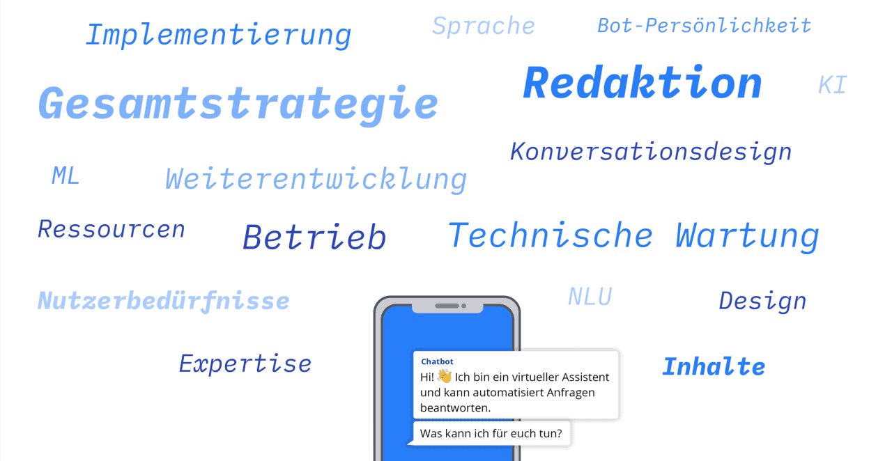

# Projekt Chatbot BMI, ITZ Bund BMFSFJ 2020

# Projekt Chatbot

Wir haben den personalisierten und proaktiven Familienlotsen Sonne als Prototypen sowie eine Checkliste als Entscheidungshilfe konzipiert, mit deren Hilfe die Eignung des Einsatzes eines Chatbots für einen konkreten Anwendungsfall geprüft werden kann.

Beide Ergebnisse wurden für die IT-Maßnahme “Chatbots für die Bundesverwaltung” der Dienstekonsolidierung erarbeitet.

#### [Fallstudie (PDF)](f1_20200930_Fallstudie_V2.pdf)

# Hintergrund & Herausforderung

Sprache ist eine der natürlichsten Kommunikationsformen für den Menschen. Dies wird bei dialogischen Benutzerschnittstellen genutzt, um Nutzer:innen effektiv zu unterstützen. Eine Ausprägungsform solcher Dialogsysteme sind Chatbots. Aufgrund fortschreitender Entwicklungen im Bereich des Natural Language Understanding und der effizienten Verarbeitung von großen Datenmengen wird diese Technologie immer leistungsstärker.

Die Bundesverwaltung möchte stetig die Kommunikation mit Bürger:innen verbessern und befasst sich aus diesem Grund auch mit dem Kommunikationskanal Chatbots. Wie bei jeder Technologie besteht auch hier die Herausforderung, das Funktionspotential an der richtigen Stelle einzusetzen, um die Vorteile wie 24/7-Erreichbarkeit und Skalierbarkeit zu nutzen. Im Rahmen des Projekts wurde untersucht, unter welchen Rahmenbedingungen die Potentiale gehoben werden können und die Chatbots einen Mehrwert für Nutzer:innen sein können.

# Ressourcen

#### [Doku BMFSFJ (PDF)](f2_BMFSFJ_Dokumentation_V1.pdf)

#### [GitHub (Code)](https://github.com/tech4germany/rasa_familienlotse) 

#### [Doku BfJ (PDF)](f3_BfJ_Doku_final.pdf)

# Chatbot Checkliste

#### [Checkliste Web](f4_Checkliste.pdf)

#### [Checkliste Poster](2_ChatbotCheckliste_Poster.png)

# Links

#### [Pressemitteilung 1](https://www.itzbund.de/SharedDocs/Pressemitteilungen/DE/20200731_T4G_Fellowship_2020.html)

#### [Pressemitteilung 2](https://www.itzbund.de/SharedDocs/Pressemitteilungen/DE/20200904_T4G_Zwischenpraesentation.html)

#### [Pressemitteilung 3](https://www.itzbund.de/SharedDocs/Pressemitteilungen/DE/20201020_T4G_Fellowship_Abschluss.html)

#### [Twitter Video](https://twitter.com/Tech4Germany/status/1311247978875715589?s=20)

# Zielsetzung & Vorgehen

Das Ziel des Bundesministerium des Innern, für Bau und Heimat (BMI) und des Informationstechnikzentrums Bund (ITZBund) im Rahmen der Dienstekonsolidierung ist es, herauszufinden, wie die Bürgerkommunikation der Bundesverwaltung mit Hilfe von Chatbots unterstützt werden kann. Im Rahmen des Fellowships wurde dies an zwei Anwendungsfällen erprobt. Diese wurden durch das Bundesamt für Justiz (BfJ) und das Bundesministerium für Familie, Senioren, Frauen und Jugend (BMFSFJ) gestellt. 

Konkret wurde untersucht, wie das Schlichtungsverfahren Luftverkehr des BfJ durch eine dialogischen Benutzerschnittstelle unterstützt werden könnte. Aufbauend auf dem vom BMFSFJ gestarteten Umsetzungsprozess eines Chatbots als erste Ausbaustufe hin zu einem Familienassistenten, wurde im Fellowship evaluiert, wie für das Familienportal des BMFSFJ Informationen und Dienstleistungen schneller, intuitiver und auf die persönlichen Belange der NutzerInnen zugeschnitten bereitgestellt werden können.

In beiden Anwendungsfällen wurde der Problemraum mit Hilfe von (Experten-)Interviews und Recherchen analysiert und Ansatzpunkte durch Synthese aus User Journeys, Personas, Prozessabläufen und Servicelandschaften identifiziert. Weiterhin wurden Lösungen generiert und durch Prototypisierung greifbar gemacht sowie mit Nutzer:innen getestet. Dabei wurde in Iterationen ergebnisoffen gearbeitet und die Erkenntnisse stetig weiterverarbeitet.

User Journeys bilden die Informationsbedürfnisse der Nutzer:innen über die Zeit ab

Mit Personas können Erkenntnisse aus Nutzerinterviews abstrahiert werden

Visualisierte Prozessabläufe helfen dabei, die Positionierung der Lösung besser zu evaluieren

# Erkentnisse & Lösung

Der Einsatz von Chatbots ist mit der Erfüllung vielfältiger Anforderungen verbunden. Zu Beginn ist eine detaillierte Analyse der Problemsituation sowie der Rahmenbedingungen erforderlich. In beiden Anwendungsfällen konnte herausgearbeitet werden, dass es wichtig ist, zuerst vorhandene Informationsquellen zu vereinfachen und zielgruppengerecht aufzubereiten. Sofern die Rahmenbedingungen stimmen, kann ein Chatbot als neuer Kommunikationskanal herangezogen werden. Der Chatbot als Lösungsmöglichkeit gilt es dann zu validieren.

Im Anwendungsfall vom BfJ wurde transparent, wie wichtig es ist, die Bedürfnisse beider Nutzergruppen zu berücksichtigen. Eine dialogbasierte Lösung sollte sowohl die Prozessvereinfachung für Bürger:innen als auch die Entlastung der SchlichterInnen zum Ergebnis haben.

Der Fall des BMFSFJ hat gezeigt, dass eine bewusste Positionierung und ein klar durchdachter Funktionsumfang im Rahmen der übergeordneten Kommunikationsstrategie wichtig sind. Die Bedürfnisse der potenziellen Nutzer:innen müssen in den Mittelpunkt gestellt werden, um mit dem Chatbot einen Mehrwert zu liefern. Dies bedeutet auch die Etablierung von fachlichen und technischen Redaktionen, um iterativ Themenfelder und offene Fragen der Nutzer:innen zu erschließen.

# Chatbot-Checkliste

Mithilfe von 16 Punkten können Chatbot-Interessierte sich schnell einen Überblick über wichtige Rahmenbedingungen verschaffen, um den eigenen Anwendungsfall auf eine mögliche Chatbot-Eignung hin zu prüfen.

# Familienlotse Sonne

Der Chatbot Sonne soll das Familienportal dort ergänzen, wo bisher spezifische, persönliche Fragen nicht beantwortet werden können.

Dabei greift Sonne proaktiv Fragen auf und lotst, anhand des Kontexts, auch zu weiteren Themengebieten.

Die Funktionalität wurde unter Zuhilfenahme der Open Source Software Rasa prototypisiert.

Um vertiefte Erkenntnisse zum vom BMFSFJ langfristig geplanten Familienassistenten zu erarbeiten, wurden auch potenzielle Einbindungen von Messenger-Diensten und Funktionen der proaktiven Beratung prototypisch aufgezeigt.

# WORAN WIR GLAUBEN

## 1 Den Mut haben, Nein zu sagen.

Frühes Validieren, ausgeprägtes Problemverständnis, Testen der Hypothesen mit Prototypen & erst dann an Technologie denken. Wenn die Technologie nicht passt, muss man nein sagen können.

## 2 Vorabcheck Chatbot-Technologie per Checkliste

Passt die Ausgangslage? Wurden andere Ausgangspunkte ausreichend behandelt? Wurde die Gesamtstrategie bedacht? Wurde der Aufwand bedacht? Wurden die Anforderungen bedacht?

## 3 (Verwaltungs-)Projekte brauchen interdisziplinäre Teams 

Nur mit diesem Setup konnten wir bei unserem Projekt eine breite Fläche an Herausforderungen bearbeiten.

## 4 Nutzerbedürfnisse sind die Bedürfnisse von Bürger:innen UND Verwaltungsmitarbeiter:innen

Anders als in der Industrie ist es beim Design digitaler Produkte in der Verwaltung zentral, nicht nur die Bedürfnisse der Endnutzer:innen des Services, etwa der Bürger:innen, sondern auch die der Bediener:innen eines Services, nämlich der Verwaltungsmitarbeiter:innen zu berücksichtigen.

## 5 Ein Chatbot braucht Pflege

Einen Chatbot aufzusetzen hat Ähnlichkeiten mit dem Aufbau eines Call-Centers: In beiden Fällen ist ein (technisches) Setup notwendig, es muss über Inhalte nachgedacht und der Service muss kontinuierlich weiterentwickelt werden.

# Unsere Ergebnisse sind frei verfügbar

## Dokumentation

Detailliertes Vorgehen und Ergebnisse des Projektteams (BMFSFJ)

#### [Doku BMFSFJ](f2_BMFSFJ_Dokumentation_V1.pdf) 

## Code

Unsere Arbeitsergebnisse zum Wiederverwenden auf GitHub

#### [Link](https://github.com/tech4germany/rasa_familienlotse) 

## Dokumentation

Detailliertes Vorgehen und Ergebnisse des Projektteams (BfJ)

#### [Doku BfJ](f3_BfJ_Doku_final.pdf) 

# das Team

**Benedikt Liebig \
**Product Fellow
[ \](https://www.linkedin.com/in/beliebig/)

**Miriam Metz \
**Design Fellow
[ \](https://www.linkedin.com/in/miriammetz/)

**Anna Steinberg \
**Engineering Fellow
[ \](https://www.linkedin.com/in/anna-steinberg-855329172/)

**Johannes Heck \
**Engineering Fellow

# Projektpartner

Bundesministerium des Innern

Informations Technik Zentrum Bund

**Ann Kristin Falkenhain** \
Digitallotsin, Projektleiterin

**René Gürth** \
Digitallotse

**Clara Thöne** \
Digitallotsin

# Projektpartner der Chatbot Pilotbehörden

Bundesministerium für Familie, Senioren, Frauen und Jugend

Bundesamt für Justiz

**Nicola Sommer** \
Digitallotsin, BMFSFJ

Daniela Pohl \
Digitallotsin, BMFSFJ
