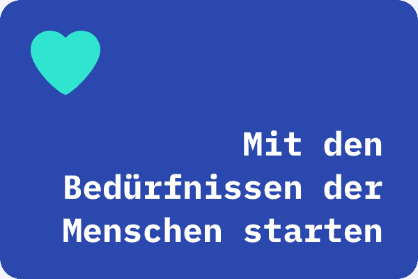
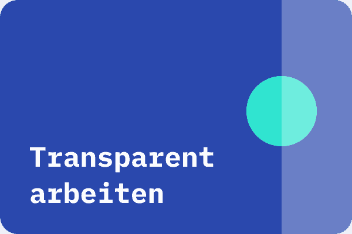
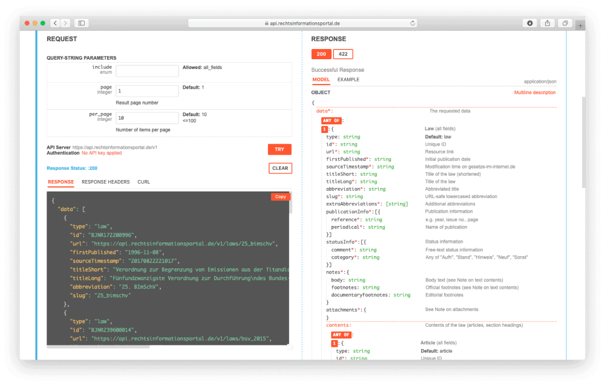

# **Rechtsinformationsportal BMJV 2020**

Darf der Zugang zu Rechtsinformationen im Jahr 2020 auf dem Stand der frühen 90er bleiben? Ein klares Urteil: Nein! Die bestehenden Portale des Bundes bieten interessierten Bürgerinnen und Bürgern keinen zeitgemäßen Zugang zu Rechtsinformationen.

# Hintergrund & Herausforderung

Die bestehenden Portale des Bundes

### [ Gesetze-im-Internet.de](https://www.gesetze-im-internet.de/),[ Rechtsprechung-im-Internet.de](https://www.rechtsprechung-im-internet.de/) und[ Verwaltungsvorschriften-im-Internet.de](https://www.verwaltungsvorschriften-im-internet.de/)

 sind nicht gut lesbar. Die Portale sind nicht mobil optimiert, der Text ist klein, die Suche ist versteckt, die Filtermöglichkeiten sind sperrig und die Suchergebnisse sind wenig aussagekräftig. Auch die Kriterien von Open Data werden nicht erfüllt. Um die Rechtsinformationen weiterzuverwenden, müssen die Daten erst umständlich heruntergeladen, formatiert, und bereinigt werden. 

Die mehr als 4 Mio. monatlichen Besuche der Seiten zeigen die Notwendigkeit für ein neues Rechtsinformationsportal, mit dem der Umfang, die Qualität und die Recherchierbarkeit von Rechtsinformationen verbessert werden.

# LINKS

### [Clickdummy](http://clickdummy.rechtsinformationsportal.de)

### [Alpha Version](https://alpha.rechtsinformationsportal.de/)

### [API ](https://api.rechtsinformationsportal.de/)

### [Github (Alpha) ](https://github.com/tech4germany/rechtsinfo-fe)

### [Github (API) ](https://github.com/tech4germany/rechtsinfo_api)

### [Fallstudie als PDF](f1_Tech4Germany_Fallstudie_Rechtsinformationsportal.pdf)

# Zielsetzung & Vorgehen

Im Rahmen des 12-wöchigen Fellowships war die Zielsetzung, so schnell wie möglich Mehrwert zu schaffen — menschenzentriert, agil und transparent. Ein IT-Großprojekt in Form eines U-Bootes, das nach Projektstart abtaucht und Ergebnisse erst zu Projektende sichtbar und testbar macht, sollte vermieden werden. Stattdessen sollte das Projekt lieber wie ein Delfin in kleineren Abständen auftauchen, Zwischenergebnisse mit Nutzer:innen testen, das Feedback für Verbesserungen nutzen und diese mit der Öffentlichkeit teilen.

Um das zu erreichen, hat das Team über 40 qualitative Interviews geführt. Wieso und in welchem Kontext brauchen Menschen Rechtsinformationen? Und wie sollten diese aufbereitet und dargestellt werden? Nachdem das Team besser verstanden hat, was die Menschen brauchen, wurden Prototypen entwickelt, um diese Annahmen zu testen. Relevante Stakeholder wurden involviert, Zwischenergebnisse mit der Öffentlichkeit geteilt und dabei ergebnisoffen kommuniziert.

Mit den Bedürfnissen der Menschen starten

Annahmen mit Prototypen testen

Transparent arbeiten

  

# Erkenntnisse & Lösungen

Aus der Nutzer:innen-Recherche hat das Team drei Erkenntnisse abgeleitet, die richtungsweisend für die entsprechenden Lösungen waren:

## 1 Nutzer:innen haben wesentliche Gemeinsamkeiten bei der Vorgehensweise und den Bedürfnissen.

Alle Nutzer:innen starten ihre Recherche bei Google und suchen zu irgendeinem Zeitpunkt den Gesetzestext. Deshalb sollte im ersten Schritt ein Basisangebot für Gesetze geschaffen werden, das von Suchmaschinen gefunden wird. 

Daher hat das Team eine erste funktionierende Version des Rechtsinformationsportals mit basalen Funktionalitäten für Gesetze entwickelt.

## 2 Nutzer:innen und ihre Bedürfnisse sind heterogen.

Daher sollten die Daten für die Weiterverwendung zur Verfügung gestellt werden, damit Lücken mit spezialisierten Angeboten von der Zivilgesellschaft und Privatwirtschaft geschlossen werden können. 

Um das zu erreichen, hat das Team eine Datenschnittstelle zum Abruf der aktuellen Gesetze entwickelt.

## 3 Nicht die juristische Vorbildung, sondern das Sicherheitsbedürfnis ist ausschlaggebend für das Rechercheverhalten. Tiefe, Dauer, Intensität

Interesse korreliert nicht zwingend mit Expertise. Auch Menschen mit nur wenig juristischem Vorwissen möchten sich umfassend und verlässlich informieren. Daher sollten alle Rechtsinformationen kostenlos und nutzerfreundlich zugänglich gemacht werden, um allen eine tiefgehende Recherche zu ermöglichen.

Diese Vision hat das Team mit Hilfe eines Clickdummys für die Fortführung des Projektes klickbar und testbar gemacht.

# Projektergebnisse: Alpha-Version, API, Clickdummy

Die Ergebnisse zeigen die Vorteile dieser Vorgehensweise: Es konnte ein früher Mehrwert durch eine Alpha Version geschaffen werden, die für Gesetze bereits basale Nutzer:innenbedürfnisse wie z.B. eine bessere Lesbarkeit und Orientierung erfüllt. Die Datenschnittstelle bietet die Grundlage für Innovation, damit Dritte spezialisierte Angebote entwickeln können. Der Clickdummy ermöglicht es, die Annahmen und Funktionen weiter zu testen, und die Entwicklung eines vollumfänglichen Rechtsinformationsportals iterativ und nutzerzentriert fortzuführen.

## Alpha-Version — Erste Version ist nach 12 Wochen live

Die Alpha Version ist eine erste funktionierende Version des Rechtsinformationsportals mit Basis-Funktionalitäten. Ziel ist es, die Machbarkeit einer iterativen Implementierung des Portals aufzuzeigen und frühzeitig Herausforderungen zu identifizieren. Es handelt sich daher nicht um ein fertiges Portal, dass Gesetze-im-Internet.de sofort ersetzen kann.

## Datenschnittstelle — Rechtsinformationen für alle

Die Schnittstelle (API) ermöglicht Dritten Zugriff auf die Daten von Gesetze-im-Internet.de. Die Zivilgesellschaft und Privatwirtschaft können das Angebot mit spezialisierten Funktionalitäten erweitern. Somit können möglichst viele der Nutzer:innengruppen befriedigt werden.

## Clickdummy — Die Zukunft ist klickbar

Der Clickdummy zeigt anhand eines konkreten Beispiels die potentiellen Funktionen des zukünftigen Rechtsinformationsportals auf. Bedürfnisse der Nutzer:innen können getestet werden und helfen im Team ein gemeinsames Verständnis zu etablieren und nach außen zu kommunizieren. Der Clickdummy basiert nicht auf der Schnittstelle, und ist somit nicht funktionsfähig. 

# Unsere Ergebnisse sind frei verfügbar

### [Alpha-Version](https://alpha.rechtsinformationsportal.de/) 

Die erste Version für Gesetze mit basalen Funktionalitäten ist live.

### [Clickdummy](http://clickdummy.rechtsinformationsportal.de) 

Die Vision des vollumfänglichen Rechtsinformationsportal ist klickbar.

### [Datenschnittstelle](https://api.rechtsinformationsportal.de/) 

Die Schnittstelle ermöglicht Dritten Zugriff auf die Daten von Gesetze-im-Internet.de.

### [Code](https://github.com/tech4germany) 

Unsere Arbeitsergebnisse zum Wiederverwenden auf GitHub.

# Das Team

 \
**Conrad Schlenkhoff** \
Product Fellow

 \
**José Ernesto Rodríguez** \
Design Fellow

 \
**Greta Fest** \
Engineering Fellow

 \
**Niko Felger** \
Engineering Fellow

# Projektpartner:innen

**Dr. Beatrix Lindner** \
Projektleiterin

**Sabine Schlüter** \
Digitallotsin

**Alexander Schiff** \
Digitallotse

**Kai Rülke** \
Digitallotse
