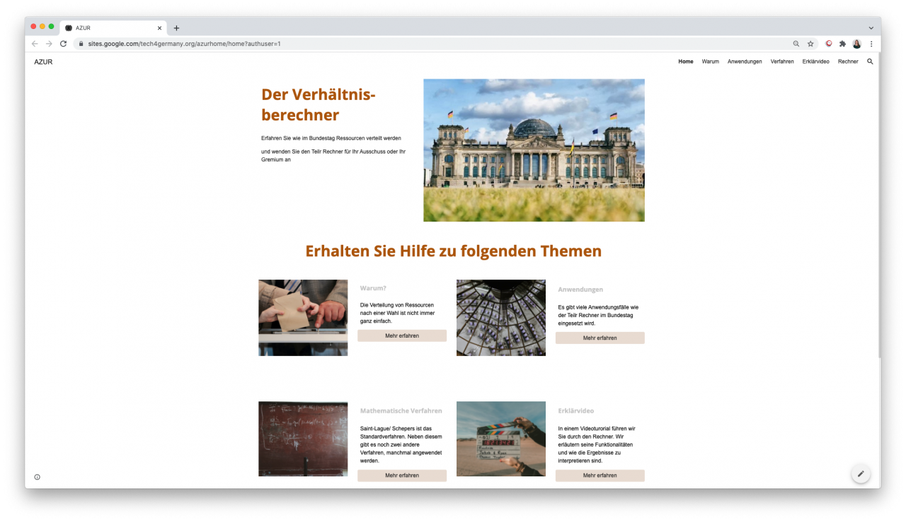
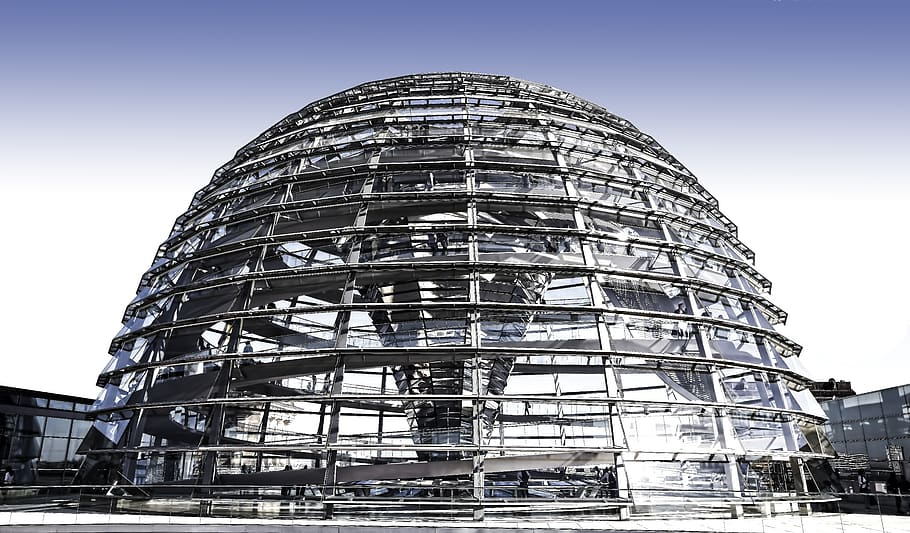

# **Anteilsberechner Deutscher Bundestag 2021**

Wie werden im Bundestag die Ausschussvorsitze, Redeminuten, oder Sitzplätze verteilt? Wir haben das Programm, das diese Ressourcen verteilt, von Grund auf neu entwickelt und dabei viel Potenzial für mehr Transparenz im Bundestag entdeckt.

### [Der Neue Rechner](https://dev.tech4germany.org/AZUR-Frontend/)

# Hintergrund & Herausforderung

Als die Herzkammer der deutschen Demokratie möchte der Bundestag für die Bürger:innen zugänglich und transparent sein. Aber trotz eines Infoangebotes wissen die meisten Bürger:innen wenig über das Innenleben des Bundestags. Mit unserem Projekt möchten wir zeigen, wie der Bundestag digitale Methoden nutzen kann, um auch diese Aspekte seiner Arbeit für Bürger:innen zugänglicher zu machen.

Hierfür beschäftigen wir uns prototypisch mit dem Rechner AZUR:

AZUR stellt sicher, dass Ressourcen im Bundestag proportional zwischen den Fraktionen verteilt werden. Fraktionen, die viele Sitze erhalten haben, dürfen deswegen zum Beispiel länger im Plenum sprechen. AZUR funktioniert zwar, ist aber 20 Jahre alt, mit aussterbenden Technologien gebaut, aktuell nicht für die Öffentlichkeit zugänglich, und intern nur für Expert:innen nachvollziehbar.

# Links

### [Der Neue Rechner](https://dev.tech4germany.org/AZUR-Frontend/) 

### [Fallstudie (PDF)](f1_Fallstudie_Bundestag.pdf)

### [Dokumentation (PDF)](f2_Projektdokumentation.pdf)

### [Infoseite (Prototyp)](https://sites.google.com/view/t4gazur/home)

### [GitHub (Frontend)](https://github.com/tech4germany/AZUR-Frontend)

### [GitHub (API)](https://github.com/tech4germany/AZUR-API)

# Zielsetzung & Vorgehen

Das Ziel des Projektes war es, AZUR von Grund auf neu zu gestalten und für die Zivilgesellschaft zugänglich zu machen. Das Programm sollte durch eine Überarbeitung der Benutzungsoberfläche und der technischen Architektur sowohl für Verwaltungsmitarbeiter:innen als auch für externe Anwender:innen intuitiv nutzbar gemacht werden.

Alles Weitere wurde direkt aus den Bedürfnissen der Nutzenden abgeleitet. Um diese zu erschließen, haben wir über 30 Interviews geführt – innerhalb und außerhalb des Bundestages, mit Verwaltungsmitarbeiter:innen, Datenjournalist:innen, oder Lokalpolitiker:innen. 

# Erkenntnisse und Lösungen

Unsere Recherche hat drei Erkenntnisse hervorgebracht, die jeweils eine Lösung generierten.

## 1 Die funktionale Tiefe des bestehenden Rechners überfordert unerfahrene Nutzer:innen.

Das jetzige Interface liefert viele Informationen auf einmal, die für einige Nutzer:innen relevant, aber für die meisten überflüssig und verwirrend sind. Wir haben das Interface des neuen Rechners deshalb stark vereinfacht, ohne die Profi-Features zu verlieren.

## 2 Erstnutzer:innen fehlt ein grundsätzliches Problemverständnis für ihre Verteilungsfragen.

Viele potenzielle Nutzer:innen schaffen es gar nicht zu dem Rechner: entweder sie haben keinen Zugriff, sie finden ihn nicht, oder es ist ihnen nicht klar, dass er überhaupt ihr Problem lösen kann. Aus diesem Grund haben wir der Rechner um eine neue Startseite mit einordnenden Informationen ergänzt, die die Nutzer:innen dabei unterstützt den Rechner auf ihr Problem anzuwenden.

## 3 Bürger:innen finden oftmals keinen Zugang zu bestehenden Informationsangeboten des Bundestages.

Interessierte Bürger:innen sind auf Mediator:innen wie Datenexpert:innen oder Journalist:innen angewiesen, um zielgerichtet Informationen über den Bundestag zu erhalten. Diese schätzen das jetzige Informationsangebot, betonen aber auch das Potenzial von seinem Ausbau und seiner Vereinheitlichung. Wir liefern ein Konzept für ein einheitlicheres Datenangebot, die „Digitale Kuppel“, und zeigen, dass der Rechner der erste Schritt zu seiner Realisierung sein kann.

# Projektergebnisse

## Der Neue Rechner

Mit einer deutlich vereinfachten Oberfläche ist der Rechner jetzt auch für Fachfremde intuitiv nutzbar. 

### [Zum Rechner](https://dev.tech4germany.org/AZUR-Frontend/) 

## Das Informationsportal

Eine Informationswebsite hilft neuen Nutzer:innen die Rolle und Funktion des Rechners zu verstehen.

### [Zur Website](https://sites.google.com/view/t4gazur/home) 

## Die Digitale Kuppel

In einer Vereinheitlichung und einem Ausbau des Datenangebotes des Bundestages liegt großes Potenzial.

In unserer Projektdokumentation stellen wir dafür unser Konzept für eine „Digitale Kuppel“ vor.

### [Zur Doku (PDF)](f2_Projektdokumentation.pdf) 

# Unsere Ergebnisse sind frei verfügbar

## Der Neue Rechner

Der neue Verhältnisberechner, vorläufig noch von Tech4Germany gehostet.

## Dokumentation

Unser detailliertes Vorgehen, unsere Ergebnisse und unser Vorschlag für die „Digitale Kuppel“.

## Code

Der gesamte Code des Rechners zur freien Wieder- und Weiterverwendung auf GitHub.

### [Zum Rechner](https://dev.tech4germany.org/AZUR-Frontend/) 

### [Zur Doku (PDF)](f2_Projektdokumentation.pdf) 

### [Frontend](https://github.com/tech4germany/azur-frontend) 
###[API](https://github.com/tech4germany/azur-API) 

# Das Team

 \
**Simone Kilian \
**Product Fellow \
[LinkedIn](https://www.linkedin.com/in/simone-kilian-540229151/)

 \
**David Probst \
**Engineering Fellow \
[LinkedIn](https://www.linkedin.com/in/daudprobst/)

 \
**Christopher Schmitz \
**Engineering Fellow \
[LinkedIn](https://www.linkedin.com/in/clschmitz/)

# Projektpartner:innen

Deutscher Bundestag

**Mathias Büchner** \
Referent, \
IT4 Systementwicklung

**Mike Laube** \
Sachbearbeiter, \
IT4 Systementwicklung

**Robert Stephan** \
Sachbearbeiter, \
IT4 Systementwicklung

