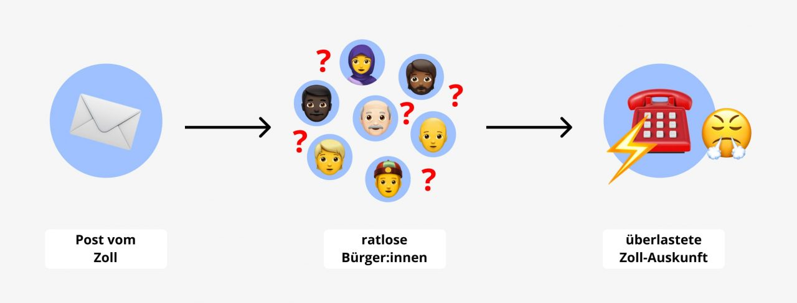
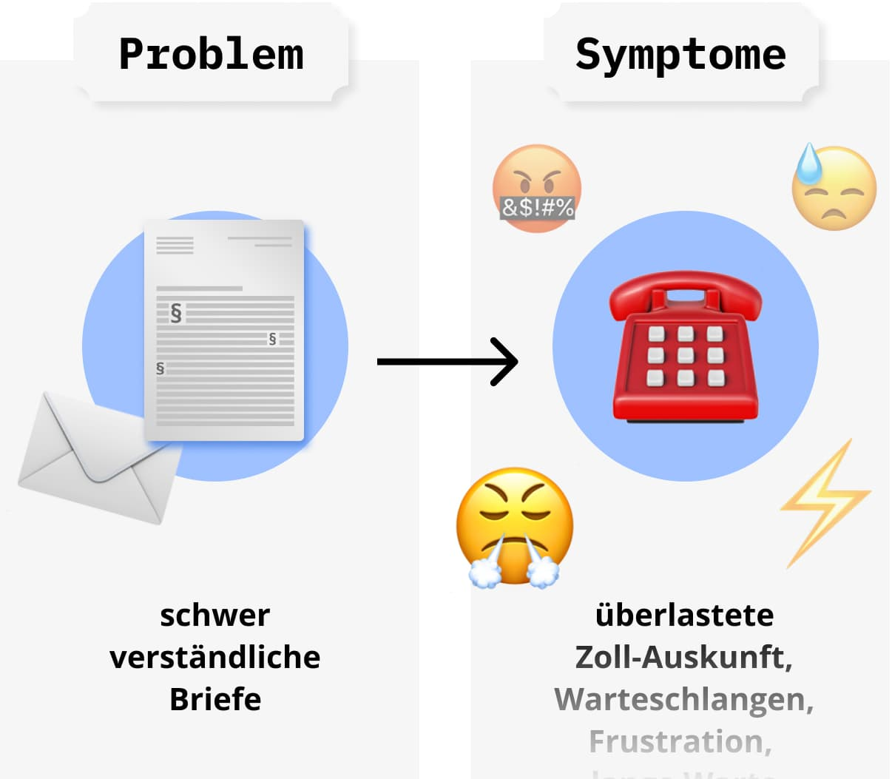
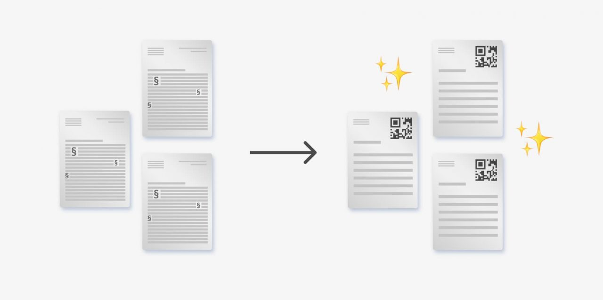
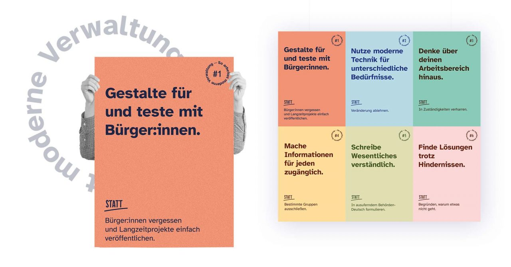

# **Barrierefreie Bürgerkommunikation Generalzolldirektion & ITZBund 2021**

# Hintergrund

**In der Auskunft des Zolls landen täglich bis zu 15.000 Anrufversuche**. Diese gewaltige Anfragelast führt zu langen Warteschleifen und Frustration auf beiden Seiten der Telefonleitung. Unser Ziel war es, eine Lösung zu entwickeln, die diese Anfragelast reduziert. 

# Ressourcen

### [Fallstudie (PDF)](f1_Fallstudie_Barrierefreie-Buergerkommunikation_barrierefrei.pdf)

### [Doku (PDF)](f2_Barrierefreie_Buergerkommunikation_Doku.pdf)

### [Leitlinien (PDF)](f3_design-prinzipien_team_gzd_itz-bund-1.pdf)

### [Mahnung neu & alt (PDF)](f4_MahnungAltNeu.pdf)

### [GitHub (Code)](https://github.com/tech4germany/Zoll-Assistent)

# LINKS

### [Prototyp](https://www.figma.com/proto/FSohhu1p2cjVo5oPKmbeSF/Digitaler_Assistent_v01?page-id=1%3A2&node-id=562%3A10777&viewport=287%2C48%2C0.18&scaling=min-zoom&starting-point-node-id=562%3A10777)

### [Pressemitteilung GZD](https://www.zoll.de/SharedDocs/Pressemitteilungen/DE/Sonstiges/2021/z03_digitalisierungsprojekt.html)

### [Pressemitteilung ITZB](https://www.itzbund.de/SharedDocs/Pressemitteilungen/DE/2021/2021-11-05_T4G_Abschluss_2021.html;jsessionid=6EF076E8BAFD97650C54324F2D693B0D.internet352?nn=178502)

# Problem vs. Symptom

Durch Interviews haben wir herausgefunden: Die 15.000 Anrufversuche pro Tag sind nicht das Problem, sondern die Symptome. Das eigentliche Problem liegt in der Kommunikation: **Wichtige Informationen sind für Bürger:innen teilweise schwer verständlich.** Besonders der häufigste Kontaktpunkt zwischen Bürger:innen und dem Zoll, ein analoger Brief, stellt bereits eine große Barriere dar. Dieser ist mit seinem Behörden-Deutsch und Paragraphentexten zu kompliziert geschrieben. Die Folge: Bürger:innen rufen an, weil sie nicht verstehen, was genau der Zoll ihnen mitteilen will.

# Unsere Lösung: Bestehendes verbessern und digital erweitern

Wir sind überzeugt, dass Nutzer:innen-Zentrierung da ansetzt, wo Probleme entstehen. Für unseren Fall bedeutete das im ersten Schritt, ein Mahnschreiben vom Zoll für eine unbezahlte Kfz-Steuer neu zu gestalten und umzuformulieren. Im zweiten Schritt gehen wir mit unserer digitalen Lösung über die Grenzen des Mediums Papier hinaus und bieten direkte Hilfestellung. Über den Scan eines QR-Codes auf dem Schreiben, rechts oben in der Ecke, können Angelegenheiten, wie z.B. die Änderung der Bankverbindung, einfach und unkompliziert erledigt werden.

## Der Brief 2.0

Verständliche Sprache, ein klares Layout und das Hervorheben wichtiger Informationen sind auch in einem Verwaltungsschreiben möglich. Am Beispiel des Mahnschreibens haben wir ein typisches Verwaltungsschreiben in einen wirklich bürger:innen-nahen Brief transformiert.

Wir sind uns dabei des Spannungsverhältnisses zwischen Bürger:innennähe und Rechtssicherheit bewusst. Deshalb schlagen wir eine **_Bürger:innen-Seite_** mit den wichtigsten Informationen sowie Handlungs-Aufforderungen vor und stellen dann Rechtssicherheit auf den Folgeseiten, den **_Jurist:innen-Seiten_**, her. Hier finden sich alle rechtlich notwendigen, aber weniger verständlichen Ausführungen.

## Der digitale Assistent

Für uns ist aber auch klar: Papier hat Grenzen. Dort, wo wir analog nicht weiterkommen, nutzen wir die Vorteile des Digitalen. So erweitern wir die Briefe um einen digitalen Assistenten. Der Aufbau des Assistenten bedient sich dabei an modular verwendbaren Funktionen. Der Assistent passt sich so je nach Brief an die Bedürfnisse der Bürger:innen an.

Aufgaben, wie die Änderung der Kontodaten, lassen sich nun schnell und digital erledigen. Außerdem ermöglichen wir Barrierefreiheitsfunktionen wie Kontrast-Einstellung, Textvergrößerung und Vorleseoptionen. Der Assistent leistet dort Hilfe, wo Probleme entstehen.

# Prozesse hinterfragen & verändern

Warum manches so kompliziert ist, hat nicht selten einen bereits obsoleten Grund. Durch das Hinterfragen und Anstoßen von Veränderungen konnten wir bestehende, höchst formalisierte Prozesse für Bürger:innen und Mitarbeitende vereinfachen.

#

# Analog anpacken

Ob auf dem Papier oder Screen, für uns setzt Bürger:innen-zentriertes Arbeiten da an, wo die Probleme entstehen. In unserem Fall: das Mahnschreiben für die Kfz-Steuer.

# Digital erweitern

Das Digitale unterstützt, wo die Grenzen des Papiers beginnen. Vorlesefunktion, andere Sprachen, größere Schrift und Angelegenheiten klären – ganz einfach digital.

# Unsere Vision: der einfache Zugang als Standard für alle Briefe der Bundesverwaltung

Zukünftig wünschen wir uns, dass alle Briefe bürger:innen-nah geschrieben und strukturiert sind. Der QR-Code oben rechts in der Ecke auf dem Schreiben soll zum Standard werden und direkte Hilfestellung bieten – da, wo sie gebraucht wird.

# Nachhaltig bürger:innen-nah kommunizieren

Barrierefrei zu gestalten bedeutet für uns, einen Zugang zu Informationen für möglichst viele Menschen zu gewährleisten. Barrierefreiheit kann nur dann erreicht werden, wenn die Inhalte für Bürger:innen verständlich aufbereitet werden. Verständlichkeit für alle ist eine Grundvoraussetzung für gute Zugänglichkeit. 

Um auch nach unserem Projekt einen Wandel hin zur bürgernahen Kommunikation zu ermöglichen, haben wir in einem Workshop gemeinsam Designprinzipen und **Arbeitsleitfäden** entwickelt.

# Unsere Ergebnisse sind frei verfügbar

## Dokumentation

Detailliertes Vorgehen und Ergebnisse des Projektteams

### [Download](f2_Barrierefreie_Buergerkommunikation_Doku.pdf) 

## Prototyp

Funktionierender Prototyp unseres digitalen Assistenten

### [Jetzt ausprobieren](https://www.figma.com/proto/FSohhu1p2cjVo5oPKmbeSF/Digitaler_Assistent_v01?page-id=1%3A2&node-id=562%3A10777&viewport=287%2C48%2C0.18&scaling=min-zoom&starting-point-node-id=562%3A10777) 

## Mahnbescheide

Neues und altes (originales) Mahnschreiben 

### [Download](f4_MahnungAltNeu.pdf) 

## Leitlinien

Unsere Leitlinien für das Arbeiten als moderne Verwaltung

### [Download](f3_design-prinzipien_team_gzd_itz-bund-1.pdf)

# das Team

**Elena Rüdenauer \
**Product Fellow \
[LinkedIn](https://www.linkedin.com/in/elena-ruedenauer/)

**Jasper Anders \
**Engineering Fellow \
[LinkedIn](https://www.linkedin.com/in/jasper-anders-9844141a2/)

**Duc Dang \
**UI/UX Design Fellow \
[LinkedIn](https://www.linkedin.com/in/ducdanghuy/)

**Sarah Heimburger \
**UI/UX Design Fellow \
[LinkedIn](https://www.linkedin.com/in/sarah-heimburger-7b68371b2/)

# Projektpartner

**Zoll **

**ITZ Bund**

**Dr. Alexander Gorski \
**Digitallotse, Referatsleiter    \
GZD

**Annett Eulitz \
**Digitallotsin, Ständige Vertretung Referatsleitung  \
GZD

**Gert Krauß \
**Digitallotse, \
Leiter Kompetenzzentrum für barrierefreie IT  \
GZD

**Ursula Rohmann ** Digitallotsin, \
Leiterin Koordinierende Stelle Barrierefreiheit \
ITZBund

**René Gürth**
Digitallotse, Referent im Referat eGovernment \
ITZBund

**Doreen Laveatz**

Digitallotsin, Fachbereich Chat- und Voicebots     \
GZD
