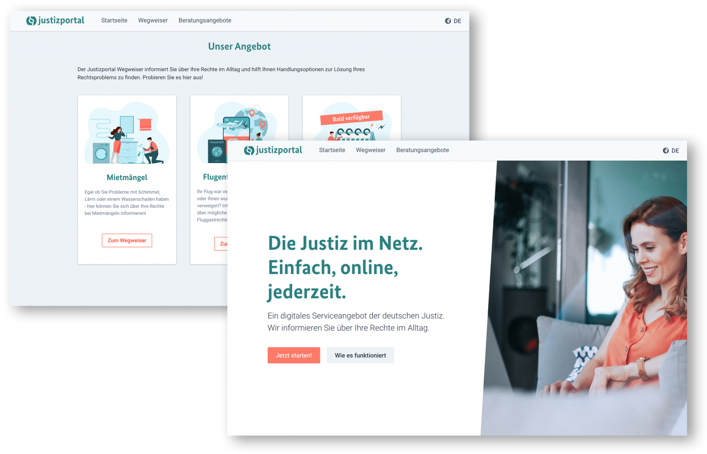
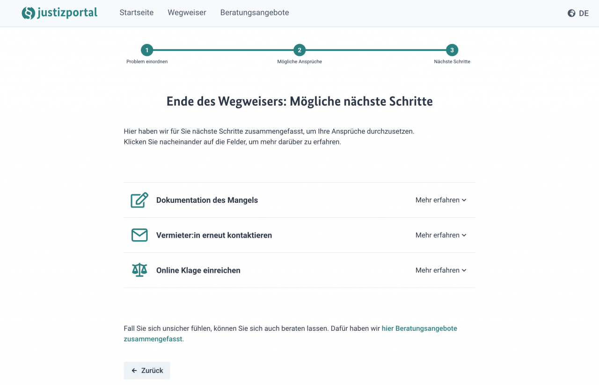
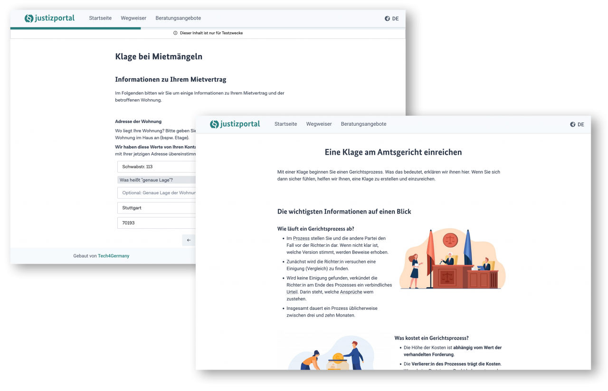
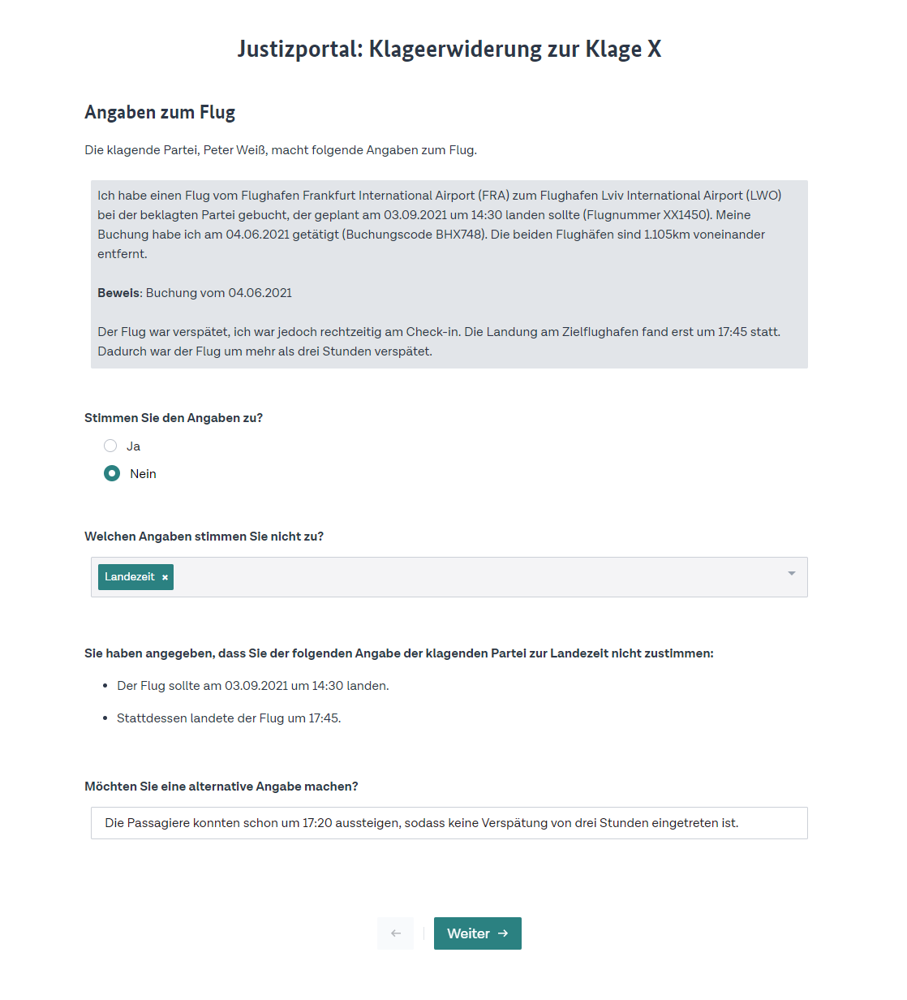

---
hide:
- toc
---

# **Digitale Klagewege BMJV 2021**

Auch wenn Bürger:innen durch unser Rechtssystem gut geschützt sind, werden gerade kleine Ansprüche häufig nicht durchgesetzt. Deshalb wurde im Tech4Germany **Fellowship 2021** mit dem **BMJV** die Vision für ein **Justizportal** entwickelt: Dieses ermächtigt Bürger:innen, Ihre Rechtsprobleme und mögliche Ansprüche bei Alltagsproblemen zu verstehen, Handlungsoptionen für Ihren Fall zu finden und falls nötig auch eine Klage einzureichen. Damit gliedert sich das Projekt in eine laufende Reform zur Modernisierung des Zivilprozesses. 

### [Fallstudie (PDF)](https://tech.4germany.org/wp-content/uploads/2021/11/Fallstudie-Digitale-Klagewege-Tech4Germany-2021.pdf)

# Hintergrund & Herausforderung

Egal ob es um Mängel in der Wohnung, eine kurzfristig annullierte Reise oder ein beim Kauf defektes Produkt geht: Rechtsprobleme betreffen uns alle. Auch wenn Bürger:innen durch unser ausgeklügeltes Rechtssystem gut geschützt sind, hindert die Komplexität viele daran, gerade kleine Ansprüche durchzusetzen. Das Ergebnis: Bürger:innen erwägen im Schnitt erst ab einem Schaden von 1.840€ eine Klage vor Gericht – ein Wert nur knapp unter dem durchschnittlichen Nettoeinkommen in Deutschland. So verzichten viele auch bei unrechtmäßigen Geschäftspraktiken auf ihre Rechte.

Gleichzeitig haben private Rechtsdienstleister einen Bedarf für leichte, digitale Rechtszugänge gezeigt. Diese nehmen Bürger:innen den Aufwand eines Rechtsstreits ab und behalten im Erfolgsfall einen Teil der geltend gemachten Entschädigung ein. Alleine der Anbieter Flightright hat nach eigenen Angaben bereits 350 Millionen Euro an Entschädigungen nach der EU-Fluggastrechteverordnung geltend gemacht. Zudem bietet die Digitalisierung auch im Gericht noch Potenzial, denn trotz eAkte werden noch wenig strukturierte Daten bei Klagen erhoben.

# Ressourcen

### [GitHub (Code)](https://github.com/tech4germany/bmjv-justizportal/)

### [Fallstudie (PDF)](f1_Fallstudie-Digitale-Klagewege-Tech4Germany-2021.pdf)

# LINKS

### [Prototyp](https://dev.tech4germany.org/bmjv-justizportal)

### [BMJV Pressemitteilung](https://www.bmjv.de/SharedDocs/Pressemitteilungen/DE/2021/0816_Online_Klagetool.html)

### [Bericht im Handelsblatt](https://www.handelsblatt.com/politik/deutschland/programm-tech4germany-digitales-angebot-der-justiz-das-staats-legal-tech-kommt/27607342.html)

### [Bericht im Anwaltsblatt](https://anwaltsblatt.anwaltverein.de/de/anwaeltinnen-anwaelte/anwaltspraxis/mit-einem-online-klagetool-den-zivilprozess-umkrempeln)

### [“Rechtsgespräch” Interview](https://rechtsgespraech.libsyn.com/folge-25-tech4germany-das-online-klagetool-des-bmjv-vernderungen-in-der-justiz-und-digitale-lehre)

# Zielsetzung & Vorgehen

Ziel des Projekts war daher, einen niedrigschwelligen Zugang zur Justiz für Bürger:innen zu schaffen und dabei Klagen in strukturierter Form bei Gericht einzureichen. So kommen Bürger:innen einfacher zu ihrem Recht, und die Gerichte können sich statt auf administrative Vorgänge umso mehr auf die Belange der Rechtssuchenden konzentrieren. Damit gliedert sich das Projekt in die aktuelle Diskussion um eine Reform zur [Modernisierung des Zivilprozesses](https://www.justiz.bayern.de/media/images/behoerden-und-gerichte/oberlandesgerichte/nuernberg/diskussionspapier_ag_modernisierung.pdf) ein, die zum Beispiel auch die Einführung eines beschleunigten Onlineverfahrens vorsieht.

Im Verlauf des Projekts wurden 50 qualitative Interviews mit rechtssuchenden Bürger:innen, Anwält:innen und Expert:innen aus der Justiz geführt. Dabei wurde der initiale Fokus auf Mieter:innen- und Fluggastrechte gelegt, da hier viele Ansprüche mit niedrigen Streitwerten entstehen und Fälle auch leicht für Bürger:innen standardisiert zu erfassen sind. 

Zudem wurden Erfolgsbeispiele aus dem Ausland, wie das kanadische [Civil Resolution Tribunal ](https://civilresolutionbc.ca/)analysiert. Diese zeigen, wie die Justiz mit effizienten, digitalen Angeboten noch mehr Konflikte lösen kann. Auf Basis dieser Erkenntnisse wurde iterativ ein Web-Prototyp entwickelt und mit Bürger:innen getestet.

# Erkenntnisse & Lösung

Im Rahmen unserer Nutzendenrecherche haben wir festgestellt, dass die Probleme beim Zugang zum Recht weit vor der Einreichung einer Klage anfangen. Dabei existieren **drei zentrale Hürden**: Durch **ein geringes Rechtsverständnis** wissen Bürger:innen häufig nicht, ob und welche gesetzlichen Regelungen es für ihren Fall gibt. Verlässliche Informationen sind dabei nicht kostenfrei und in einfacher Sprache verfügbar, was gerade strukturell benachteiligte Gruppen trifft. Deshalb sind Bürger:innen auch ihre **Handlungsoptionen unklar**: Also welche rechtlichen Ansprüche sie haben, und wie sie diese durchsetzen können, auch wenn keine Einigung mit der Gegenseite möglich scheint. Schließlich stellt auch die **Komplexität von Gerichtsprozessen **eine Hürde dar: Der Prozess wird dabei teilweise als einschüchternde “Black Box” empfunden, die für Nichtjurist:innen kaum zu durchschauen, geschweige denn zu navigieren ist. Dazu tragen auch das schwer überblickbare Prozesskostenrisiko und lange Verfahrensdauern bei.

# Der Justizportal Prototyp:  \
unser Angebot an Bürger:innen

Hier führen wir Sie beispielhaft durch das Angebot des Justizportals. Für den Fall [Mietmängel](https://dev.tech4germany.org/bmjv-justizportal/wegweiser?id=ceppdowbfco0)und [Ausgleichszahlungen aus der EU-Fluggastrechteverordnung ](https://dev.tech4germany.org/bmjv-justizportal/wegweiser?id=cf008ca222o0#s)können Sie den Prototypen dabei selbst ausprobieren.

## Wegweiser: Einordnung meines Rechtsproblems

Der Wegweiser hilft Bürger:innen, für verschiedene Bereiche Ihres Alltags Rechtsprobleme und mögliche Ansprüche zu identifizieren. Dabei werden die relevanten Informationen mit einfachen Ja-Nein-Fragen eingegrenzt. Kann das Portal den Fall nicht abdecken, wird an Beratungsstellen verwiesen.

### [Zum Wegweiser](https://dev.tech4germany.org/bmjv-justizportal/wegweiser)

## Wegweiser: Mögliche Ansprüche in meinem Fall

Basierend auf den eigenen Antworten fasst der Wegweiser die möglichen rechtlichen Ansprüche zusammen. Über diese können sich die Bürger:innen dann in Ruhe informieren.

### [Zur Anspruchsübersicht](https://dev.tech4germany.org/bmjv-justizportal/moegliche-ansprueche?id=ceybyumxibs0)

## Wegweiser: Nächste Schritte

Zuletzt empfiehlt der Wegweiser mögliche Schritte, um die eigenen Ansprüche auch durchzusetzen: Zunächst für eine direkte Einigung mit der Gegenseite, beispielsweise durch eine [Vorlage für ein Schreiben an die Vermieter:in](https://dev.tech4germany.org/bmjv-justizportal/formular?mangelanzeige). So können die meisten Probleme einvernehmlich gelöst werden.

### [Zu den Handlungsoptionen](https://dev.tech4germany.org/bmjv-justizportal/naechste-schritte?id=ceybyumxibs0)

## Klage am Amtsgericht einreichen

Wenn keine einvernehmliche Lösung gefunden werden kann, unterstützt das Justizportal auch bei der Einreichung einer Klage. Dabei wird zunächst der Ablauf des Prozesses und die zu erwartenden Kosten transparent erklärt. Im Anschluss können die Bürger:innen über ein Webformular ihren Sachverhalt strukturiert eingeben. Daraus wird dann automatisch eine vollständige Klageschrift erstellt.

### [Zur Klageerstellung](https://dev.tech4germany.org/bmjv-justizportal/klage-einreichen?id=ceybyumxibs0)

## Beratungsangebote und Finanzierungshilfen

Über den gesamten Wegweiser hinweg werden Bürger:innen auch immer wieder über Anlaufstellen für eine Rechtsberatung informiert, wie beispielsweise Anwält:innen oder Mietervereine. Dabei wird zudem auf Finanzierungshilfen wie den Beratungshilfeschein oder die Prozesskostenhilfe aufmerksam gemacht. So können auch strukturell benachteiligte Gruppen eine Rechtsberatung erhalten und Ihre Rechte durchsetzen.

### [Zur Beratungsübersicht](https://dev.tech4germany.org/bmjv-justizportal/beratungsangebote)

# Der nächste Schritt: Einbindung von Beklagten & Richter:innen

Perspektivisch können auch **Beklagte und Richter:innen** **digital** **angebunden werden**, um Klagen strukturiert beantworten und bearbeiten zu können. Das ermöglicht ein **ressourcenschonendes Arbeiten** auf Seiten der Beklagten und der Justiz. So kommen Bürger:innen häufiger zu Ihrem Recht und die Gerichte können sich umso mehr auf die Belange der Rechtssuchenden konzentrieren. Dadurch können auch Verfahrensdauern und -kosten für alle Beteiligten reduziert werden.

## Schnittstelle für Beklagte

## Schnittstelle für Richter:innen

# Für die Weiterentwicklung eines bürgernahen Justizportals haben wir folgende Designanforderungen erarbeitet:

## 1 Bürgernahe Sprache

Bürger:innen müssen auch juristische Informationen in verständlicher Form erhalten können, gerade wenn Deutsch nicht ihre Muttersprache ist. Darüber hinaus helfen Angebote in weiteren Sprachen. 

## 2 Individualisierte Informationen

Rechtstexte haben oft bürger:innenfreundliche Inhalte, aber einen komplexen Aufbau. Mit einem Abfragesystem lässt sich ein Nutzungserlebnis wie in einem Gespräch erreichen. Dabei werden den Bürger:innen auf ihren Fall zugeschnittene Informationen bereitgestellt: Sie sollen _nur erfahren, was sie wissen müssen und erst dann, wenn sie es wissen müssen._ Beispieltexte sollten deshalb nicht allgemein, sondern spezifisch formuliert werden (bspw. für _Schimmel in der Wohnung_ statt für einen _Mietmangel_).

## 3 Kosten / Nutzen-Schätzung erleichtern

Ein Gerichtsverfahren verursacht Aufwand. Deshalb müssen Bürger:innen abschätzen können, ob sich der Weg für sie lohnt. Besonders wichtig ist für sie zu wissen, auf welches Risiko sie sich finanziell und zeitlich einlassen. Dabei reicht schon eine ungefähre Größenordnung.

## 4 Pflege in interdisziplinären Teams

Rechtsinformationen korrekt und bürgernah zu formulieren erfordert verschiedene Fähigkeiten. Deshalb sollten neue Fälle in interdisziplinären Teams aus Jurist:innen und bspw. Verbraucherexpert:innen erarbeitet werden. Daher empfiehlt sich die Implementierung des Portals mit einer _No_ oder _Low Code Lösung_, sodass Expert:innen selbstständig Inhalte einpflegen können.

## 5 Agile Entwicklung

Um anforderungsorientiert und kosteneffizient zu arbeiten, sollte das Justizportal iterativ und datenbasiert weiterentwickelt werden. So kann nach kurzen Entwicklungszyklen getestet werden, welche Angebote von Bürger:innen am meisten nachgefragt werden. Neu entdeckte Anforderungen lassen sich dabei direkt im nächsten Entwicklungszyklus integrieren.

# Unsere Ergebnisse sind frei verfügbar

## Fallstudie

Vorgehen und wichtigste Erkenntnisse des Projektteams

### [Download](f1_Fallstudie-Digitale-Klagewege-Tech4Germany-2021.pdf) 

## Prototyp

Die Justizportal Vision selbst erleben

### [Link](https://dev.tech4germany.org/bmjv-justizportal) 

## Code

GitHub Repository der WebApp

### [Link](https://github.com/tech4germany/bmjv-justizportal) 

# das Team

**Marcus Novotny** \
Product Fellow

**Eileen Einwächter** \
Design Fellow

**Michael Laßmann** \
Engineering Fellow

**Nils Thamm** \
Engineering Fellow

# Projektpartner:Innen

Bundesministerium der Justiz und für Verbraucherschutz

**Sina Dörr** \
Digitallotsin,  \
Richterin & Referentin

**Philip Scholz** \
Digitallotse, \
Referatsleiter

**Ragna Kretschmer** \
Digitallotsin, \
Richterin

**Martin Säcker** \
Digitallotse, \
Richter

