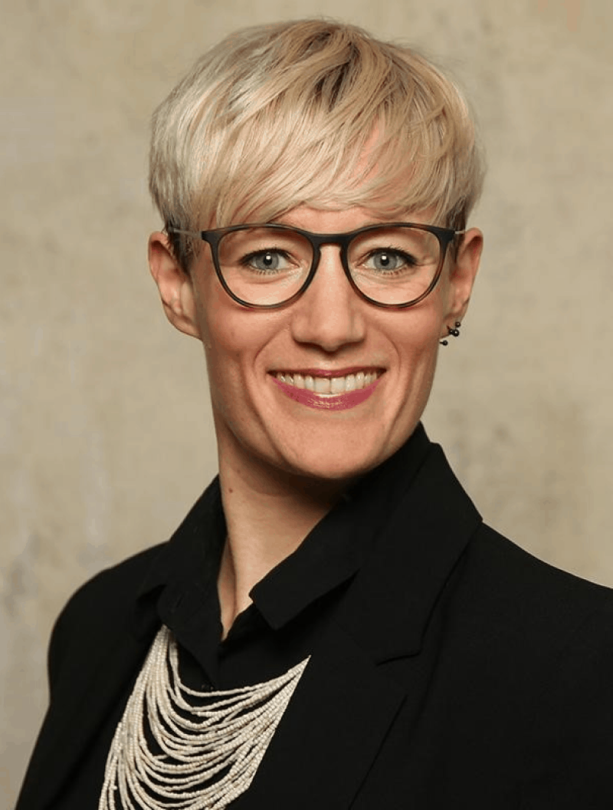
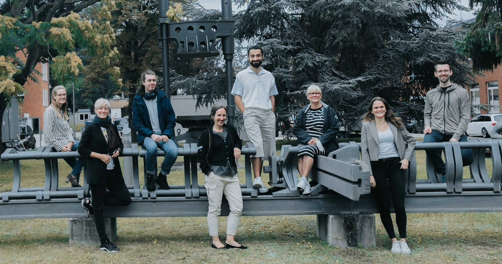

# **Projekt Diversitätssensible Sprache Bundesanstalt für Materialforschung und -Prüfung 2021**

# INCLUSIFY

Zusammen mit der Bundesanstalt für Materialforschung und -prüfung (BAM) haben wir eine prototypische Lösung für die Verwendung diversitätssensibler Sprache entwickelt. Mit INCLUSIFY wollen wir für Diversität sensibilisieren und die Anwendung sensibler Sprache unterstützen. Mit einer Webpage und einem Word-Addin ist der Prototyp in der BAM bereits im Einsatz.  

### [Fallstudie (PDF)](f1_Fallstudie_BAM.pdf)

# +++ Als Diversifix live +++

Fellows und Digitallots:innen haben einen Verein gegründet, um Diversifix allen zur Verfügung zu stellen. 

### [Jetzt Diversifix ausprobieren](https://diversifix.org/) 

# Hintergrund & Herausforderung

In einer diversen Gesellschaft wird jede Person wertgeschätzt und gleich behandelt, unabhängig von Geschlecht, Religion, Herkunft oder Alter. Sprache kommt dabei eine wichtige Bedeutung zu: bestimmte Worte können Menschen verletzen oder ausschließen. Diversitätssensible Sprache ermöglicht einen sensiblen Umgang mit verschiedenen Lebensrealitäten, gesellschaftlichen Positionen, Differenzen und Diskriminierung. Für die BAM ist es wichtig, der Diversität ihrer Mitarbeitenden gerecht zu werden und diversitätssensible Sprache in der alltäglichen Kommunikation einzusetzen. Ein uneinheitliches Verständnis in der Organisation und der individuelle Aufwand in der Verwendung der Sprache stellen eine große Herausforderung dar. 

# Ressourcen

### [GitHub (Code) ](https://github.com/tech4germany/bam-inclusify)

### [Fallstudie (PDF)](f1_Fallstudie_BAM.pdf)

### [Dokumentation (PDF)](f2_Externe_Projektdokumentation_BAM.pdf)

### [Personas (PDF)](f3_Personas_Final.pdf)

### [Prototyp](https://diversifix.org/)

# Zielsetzung & Vorgehen

Mit Beginn des Projekts haben wir uns das Ziel gesetzt, zu verstehen, welche Rolle diversitätssensible Sprache im Arbeitsalltag der BAM spielt und welche Hindernisse die Anwendung erschweren. Mit Hilfe von Interviews mit Expert:innen aus Wissenschaft und Praxis und Desk Research zu den Themen Sprachwandel, Diversität und Kulturwandel haben wir uns der Herausforderung angenähert. Darüber hinaus haben uns Interviews mit über 20  Mitarbeitenden der BAM dabei geholfen, die Organisation und die tatsächlichen Herausforderungen in Zusammenhang mit diversitätssensibler Sprache zu identifizieren. 

# Erkenntnisse & Lösung

### Gallery   

## Erkenntnisse aus den Interviews

Aus den Interview-Erkenntnissen haben wir in Workshops zwei Probleme identifiziert:

Die Verwendung diversitätssensibler Sprache ist **aufwändig & lenkt** ab.

Es herrscht **kein einheitliches Verständnis** von diversitätssensibler Sprache.

## Das Ergebnis: INCLUSIFY 

Basierend darauf haben wir verschiedene Lösungen und Produktfeatures identifiziert und gemeinsam priorisiert. Damit haben wir INCLUSIFY entwickelt. INCLUSIFY sensibilisiert für das Thema Diversität und unterstützt den Einsatz diversitätssensibler Sprache. Mit der (prototypischen) Softwarelösung wird kein Sprachstil vorgeschrieben: Nutzende können frei wählen, ob und welche Vorschläge sie annehmen. Der Prototyp wird in der BAM bereits für erste Testzwecke eingesetzt. Unsere Vision ist ein behördenübergreifender Einsatz der Lösung.

Damit die Anwendung einfach in den Arbeitsalltag integriert werden kann, haben wir eine alleinstehende Webseite und eine Integration für Microsoft Word entwickelt.

# Wie funktioniert das? Ein BLICK AUF DIE Webversion

## 1 Text überprüfen

Text zum Überprüfen einfügen und auf »Prüfen« klicken

## 2 Vorschläge anschauen

Rechts erscheinen verschiedene Vorschläge, mit denen der Text diversitätssensibler gestaltet werden kann

## 3 Vorschlag annehmen

Wenn du auf einen Vorschlag klickst, wir dieser angenommen und das Wort im Text ersetzt. 

## 4 Dein Text ist diversitätssensibel!

Wenn du alle Vorschläge durchgegangen bist und deine Formulierungen angepasst hast, ist dein Text diversitätssensibel.

# Unsere Ergebnisse sind frei verfügbar

## Dokumentation

Detailliertes Vorgehen und Ergebnisse des Projektteams

### [Download](f2_Externe_Projektdokumentation_BAM.pdf) 

## Prototyp

Funktionierender  \
INCLUSIFY Prototyp

### [Link](https://diversifix.org/) 

## Code

Unsere Arbeitsergebnisse zum Wiederverwenden auf GitHub

### [Link](https://github.com/tech4germany/bam-inclusify) 

# Das Team

 \
**Sonja Möbius \
**Product Fellow

[LinkedIn](https://www.linkedin.com/in/sonja-moebius/)

 \
**Kerem Demir \
**Design Fellow

[LinkedIn](https://www.linkedin.com/in/demirkerem/)

 \
**Patrick Lehner \
**Engineering Fellow

[LinkedIn ](https://www.linkedin.com/in/lehnerpat/)

 \
**David Pomerenke \
**Engineering Fellow

[LinkedIn](https://www.linkedin.com/in/davidpomerenke/)

### Projektpartner:innen

Bundesanstalt für Materialforschung und -prüfung 

 \
**Godela von Drygalski** \
Digitallotsin

 \
**Gabriela Burkhardt** \
Digitallotsin

 \
**Marina Staudt** \
Digitallotsin

 \
**Julia Sommer** \
Digitallotsin

 \
**Dr. Özlem Özcan** \
Digitallotsin

 \
**Dr. Franziska Emmerling** \
Digitallotsin

