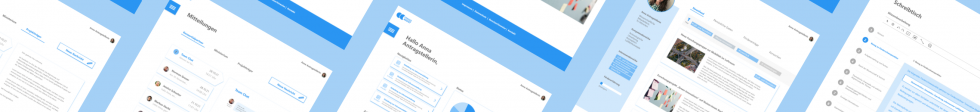
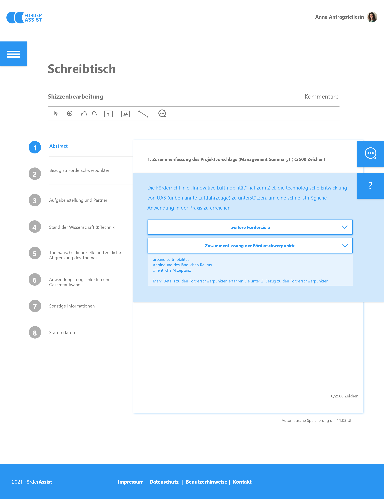
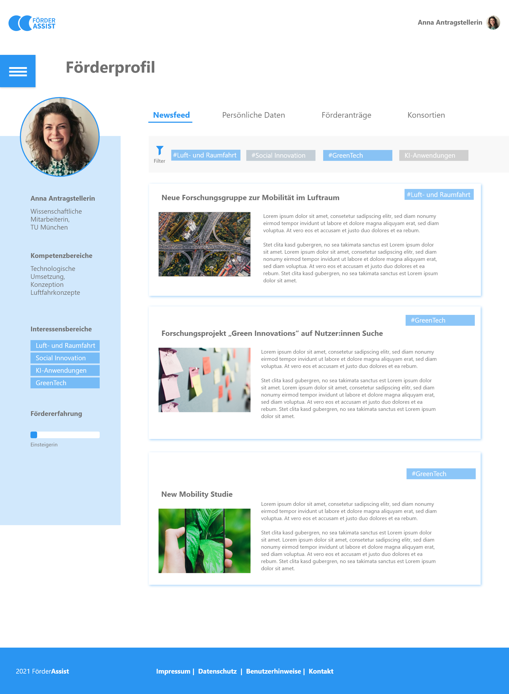
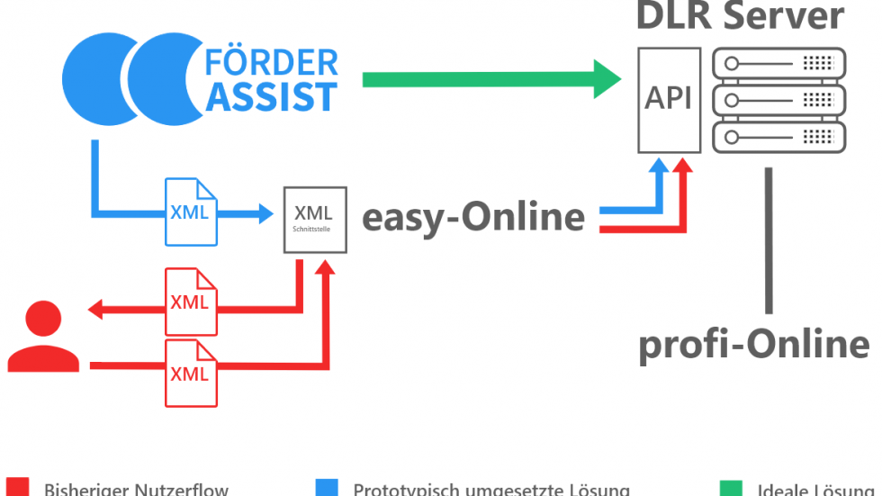

# **Projekt Fördermittelvergabe BMVDI 2021**

# FörderAssist

FörderAssist **begleitet Antragstellende** durch den Prozess der Fördermittelbeantragung. Insbesondere für unerfahrene Antragstellende ist der Prozess jedoch oft herausfordernd. Der Ansatz von FörderAssist kombiniert **Prozessbegleitung mit Wissensvermittlung**, um Antragstellenden bei Einreichungen zu unterstützen – und durch formal korrekte Anträge auch **Bearbeitenden Arbeit zu ersparen**.

### [Fallstudie (PDF)](f1_CaseStudy_T4G_2021_BMVI_Foerdermittelvergabe.pdf)

# Hintergrund & Herausforderung

Die Vergabe von Fördermitteln ist eines der **wichtigsten Instrumente der öffentlichen Hand**. Sowohl die Beantragung als auch die Bearbeitung von Fördermitteln stellen jedoch eine **Herausforderung** dar. Förderprozesse sind teils so kompliziert, dass viele Mittel langsam oder nicht abgerufen werden. Eingereichte Anträge beinhalten häufig fehlende oder falsche Angaben, die durch die Bearbeitenden in einer Vielzahl von Telefonaten und E-Mails individuell geklärt werden müssen. Auch die **Bearbeitung der Anträge** ist sehr aufwändig und beinhaltet viele manuelle Prüfschritte. Ziel dieses Projektes war daher die Vereinfachung der Antragsprozesse und **Verbesserung der Nutzerführung**, um Zeiteinsparungen auf allen Seiten zu erreichen und den Zugang zu Fördermitteln zu erleichtern.

# Ressourcen

### [Fallstudie (PDF)](f1_CaseStudy_T4G_2021_BMVI_Foerdermittelvergabe.pdf)

### [Dokumentation (PDF)](f2_Projektdoku_T4G_2021_BMVI.pdf)

### [GitHub (Code) Frontend](https://github.com/Paul-Geppert/t4g_proposal_submission_tool)

### [GitHub (Code) Backend](https://github.com/Paul-Geppert/t4g_proposal_backend)

# Links

### [Präsentation (YouTube)](https://www.youtube.com/watch?v=JzYIt1j5bwI)

# Zielsetzung & Vorgehen

Das Projekt verlief entlang eines nutzerzentrierten Gestaltungsprozesses und bediente sich der Methoden des **Human Centered Designs**. Zunächst wurden Erkenntnisse durch **Interviews** mit unterschiedlichen Stakeholdern gewonnen: Antragstellende, Projektträger, Bearbeitende im Ministerium sowie beratende Stellen wie die Förderberatung des Bundes. **Förderprozesse** wurden identifiziert und visualisiert. Probleme sowie **Ansatzpunkte** wurden auf Prozesse gemappt und **Bedürfnisse** von Nutzer:innen definiert. Eine Priorisierung der Ansatzpunkte sowie Ideenfindung wurde in **enger Zusammenarbeit** mit dem Ministerium vorgenommen.

# Erkenntnisse & Lösung

Durch die Kombination von Einreichung mit Wissensvermittlung, sollen Antragstellende **ohne weitere Unterstützung überwiegend fehlerfreie Skizzen** erstellen können.

**Impact:**

**Fairness**: Wissensgefälle zwischen erfahrenen und unerfahrenen Antragsteller:innen angleichen

**Effizienz**: Fehler und Rückfragen in der Skizzenphase reduzieren, um Projektträger und Ministerium zu entlasten

**Effektivität**: Faire und effizientere Prozesse garantieren, dass Gelder immer bei den förderwürdigsten Projekten landen

FörderAssist **begleitet Antragsteller:innen schrittweise** durch den Prozess der Skizzeneinreichung mit folgenden Features:

**Individualisiertes Wissen** und spezifische Hinweise für Antragsteller:innen

**Zentrale** Stelle zur Bearbeitung und Einreichung von Skizzen

**Kollaboratives** Tool für Antragsteller:innen, **Projektträger** und **Ministerium**

Ein programmierter Prototyp demonstriert die **simple Anbindung** an etablierte Systeme wie easy-Online/Profi und lässt sich daher direkt **in bestehende Abläufe integrieren**.

# Galerie        

# Fördermittelbeantragung mit FörderAssist

## FörderAssist

Die ressortübergreifende Plattform FörderAssist unterstützt Bewerber:innen von Fördermitteln, indem sie die aktuell wichtigsten Informationen zur Verfügung stellt, die Skizzeneinreichung nutzerfreundlich gestaltet, verschiedenste Informationsquellen vereint und die Kommunikation mit allen Beteiligten im Prozess vereinfacht.

## Das Dashboard zeigt auf einen Blick die wichtigsten Informationen

Das Dashboard präsentiert Bewerber:innen alle für sie relevanten Informationen: den aktuellen Status ihrer Skizze bzw. Antrags, Ankündigungen für Termine und neue Förderaufrufe, neueste Nachrichten und den Zugang zu Informationsquellen zur Antragstellung.

## Mit dem Schreibtisch-Tool können qualitativ hochwertige Skizzen und Anträge entwickelt werden

Ministerien erstellen für jeden Förderaufruf ein Template, das von den Bewerber:innen ausgefüllt wird. Mit hinterlegten Plausibilitätschecks und Validierungen können formale Fehler frühzeitig ausgeschlossen werden.

Um unnötige Kommunikation zu vermeiden, können Ministerien und Projektträger Informationen und Hilfestellungen hinterlegen, die von den Bewerber:innen genutzt werden kann. Diese können dynamisch angepasst werden, etwa um häufig auftretende Fragen zu ergänzen.

Bewerber:innen können die Kollaborationsfunktionen des Schreibtisches nutzen, um sich mit Projektpartnern auszutauschen oder Feedback einzuholen.

## Durch das Förderprofil den Überblick behalten und individuelle Empfehlungen erhalten

Im Förderprofil können Bewerber:innen zu jedem ihrer Anträge oder Skizzen den aktuellen Bearbeitungsstatus, nächste notwendige Schritte und Informationen abrufen.

Durch Angabe von Interessenfeldern, bzw. Förderbereiche, können Bewerber:innen individuelle Empfehlungen für aktuelle und zukünftige Förderprogramme und -aufrufe erhalten.

# „Hack the FörderSystem“

easy-Online ist ein weitverbreitetes Tool zur Einreichung von Projektskizzen und Anträgen. Es ist angegliedert an weitere Systeme zur Antragsbearbeitung und Finanzverwaltung. Allerdings hat es auch verschiedene Nachteile, wie eine schlechte Nutzerfreundlichkeit. Unter anderem können Daten nicht gespeichert werden, sondern müssen als XML-Datei herunter- und wieder hochgeladen werden (roter Fluss im Diagramm).

FörderAssist **baut auf die Funktionen von easy-Online auf**, und löst gleichzeitig Probleme wie die fehlende Nutzerfreundlichkeit. Wir bieten Nutzer:innen eine selbst generierte, zu easy-Online kompatible XML-Datei, mit der alle nötigen Angaben in easy-Online automatisch ausgefüllt werden (blauer Fluss im Diagramm).

Wir bilden damit das **Fundament, für stetige, nutzerzentrierte Verbesserungen** des Fördersystems und den zugehörigen IT-Systemen. Perspektivisch können diese in Zukunft sogar ersetzt werden (grüner Fluss im Diagramm).

# Unsere Haupterkenntnisse:

## 1 Wissensvermittlung als Hebel

Zunächst lag der Fokus des Projekts auf der Bearbeitung von Anträgen im Ministerium oder bei Projektträgern. Für eine effektive Veränderung muss jedoch früh angesetzt werden. Die Befähigung von Antragstellenden zu Beginn des Prozesses durch Wissensvermittlung vermeidet aufwändige Absprachen und Nachforderungen mit den Behörden. So wird der Prozess sowohl fairer als auch effizienter.

## 2 Veränderung mit Bestehendem

Gerade in der Verwaltung kann schnelle Innovation bedeuten, Bestehendes zu integrieren. Insofern dockt der Prototyp FörderAssist an etablierte Tools wie easy-Online an. Durch das Ausnutzen einer Schnittstelle ist es möglich, den intuitiven Prototyp FörderAssist zu nutzen, aber auf Seite der Bearbeitenden mit den bekannten Lösungen zu arbeiten.

## 3 Zentralisierung ressortübergreifend denken

Antragstellende finden oft nur mit Aufwand das passende Förderprogramm, denn Informationen sind oft auf Ministerien verteilt. Die Themen der Vorhaben und Programme sind jedoch nicht immer so trennscharf wie Ressortgrenzen. Aus Nutzer:innenperspektive würde daher eine ressortübergreifende, zentrale Plattform einen großen Mehrwert bieten.

# Unsere Ergebnisse sind frei verfügbar

## Dokumentation

Detailliertes Vorgehen und Ergebnisse des Projektteams

### [Download](f2_Projektdoku_T4G_2021_BMVI.pdf) 

## Präsentation

Vorstellung des Projekts und Prototypen

### [Aufzeichnung](https://www.youtube.com/watch?v=JzYIt1j5bwI) 

## Code

Unsere Arbeitsergebnisse zum Wiederverwenden auf GitHub

### [GitHub](https://github.com/Paul-Geppert/t4g_proposal_submission_tool) 

# Das Team

**Benedikt Kau \
**Product Fellow \
[LinkedIn](https://www.linkedin.com/in/benediktkau/) \
[GitHub](https://github.com/benediktkau)

**Huyen Trang Nguyen \
**Design Fellow \
[LinkedIn](https://www.linkedin.com/in/huyentrangux/)

**Paul Geppert \
**Engineering Fellow \
[LinkedIn](https://www.linkedin.com/in/paul-geppert-a12675155/) \
[GitHub](https://github.com/Paul-Geppert)

**Svenja Nevermann \
**Design Fellow \
[LinkedIn](https://www.linkedin.com/in/svenja-nevermann-a9760212b/)

# Projektpartner:innen

**Bundesministerium für Verkehr und digitale Infrastruktur**

**Alexander Dürnagel \
**Referatsleiter \
[E-Mail](mailto:alexander.duernagel@bmvi.bund.de)

**Nadine Huke \
**Sachbearbeiterin \
[E-Mail](mailto:nadine.huke@bmvi.bund.de)

**Raphael Schönball \
**Werkstudent \
[E-Mail](mailto:raphael.schoenball@bmvi.bund.de)

