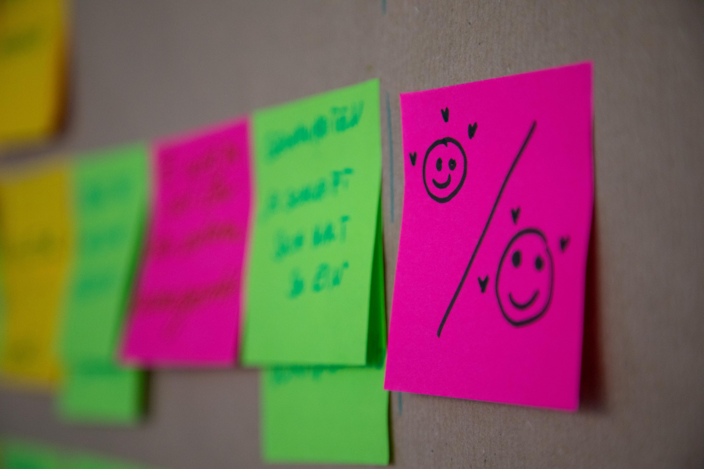
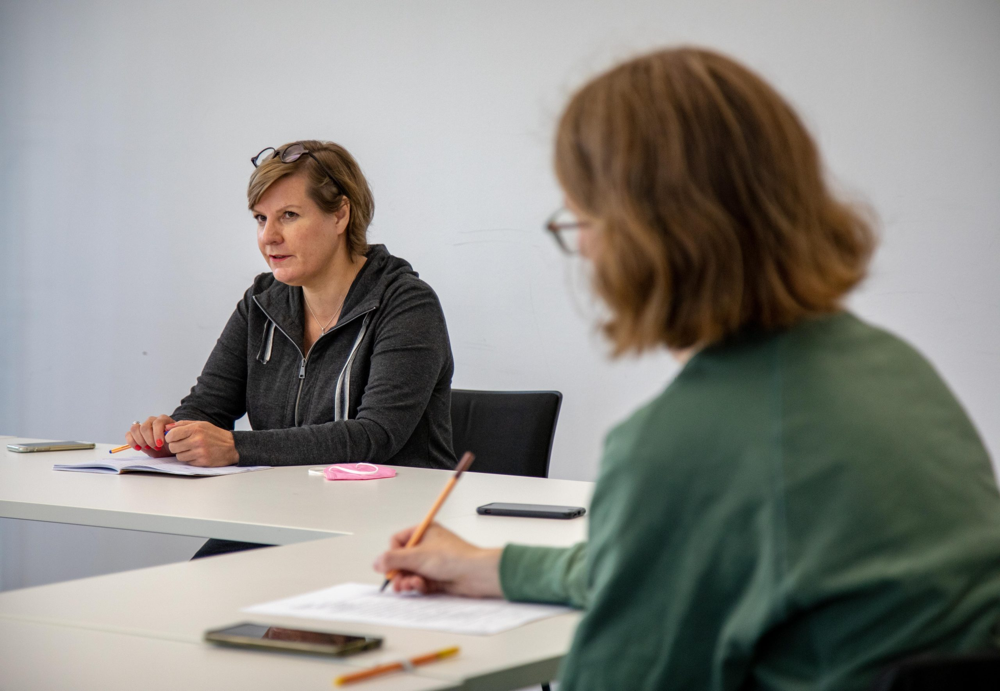
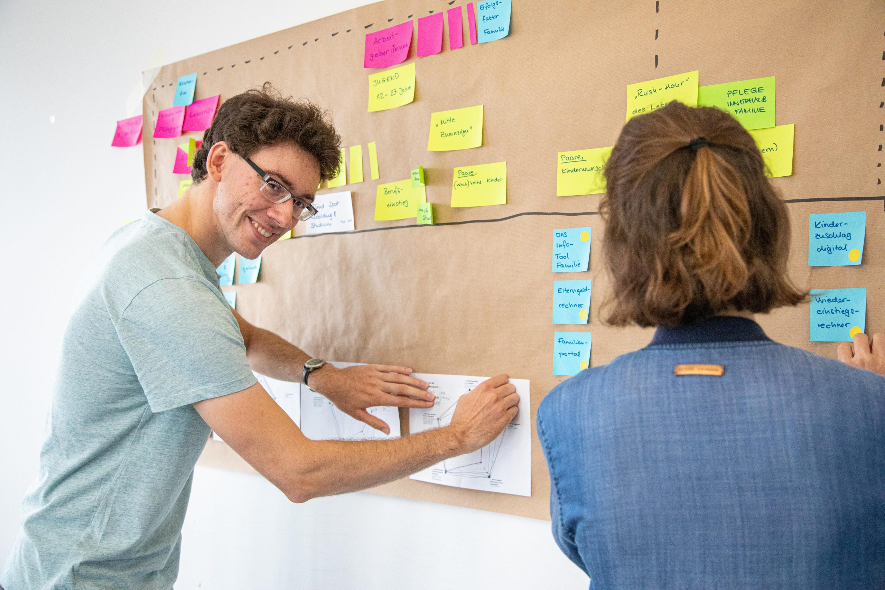
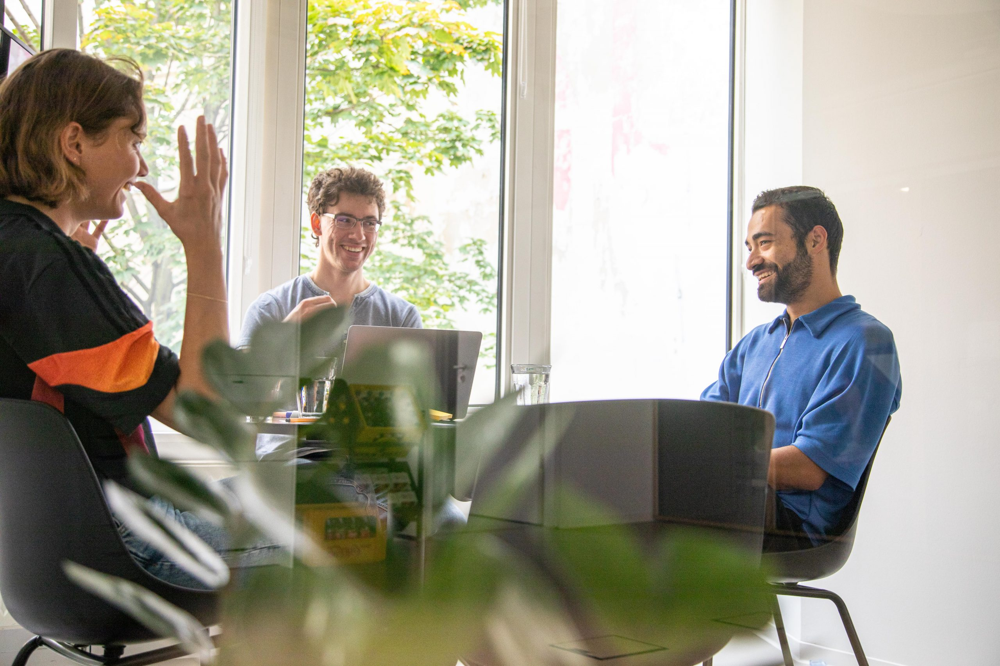
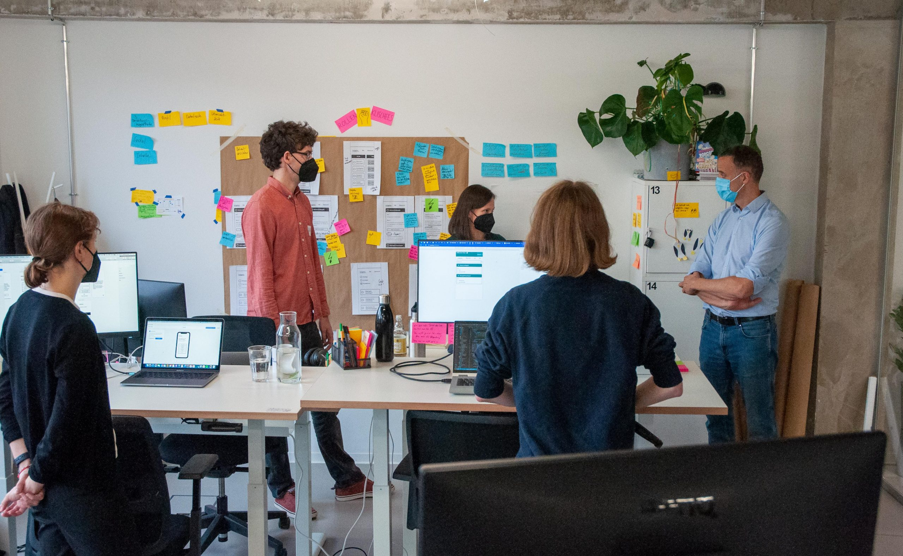
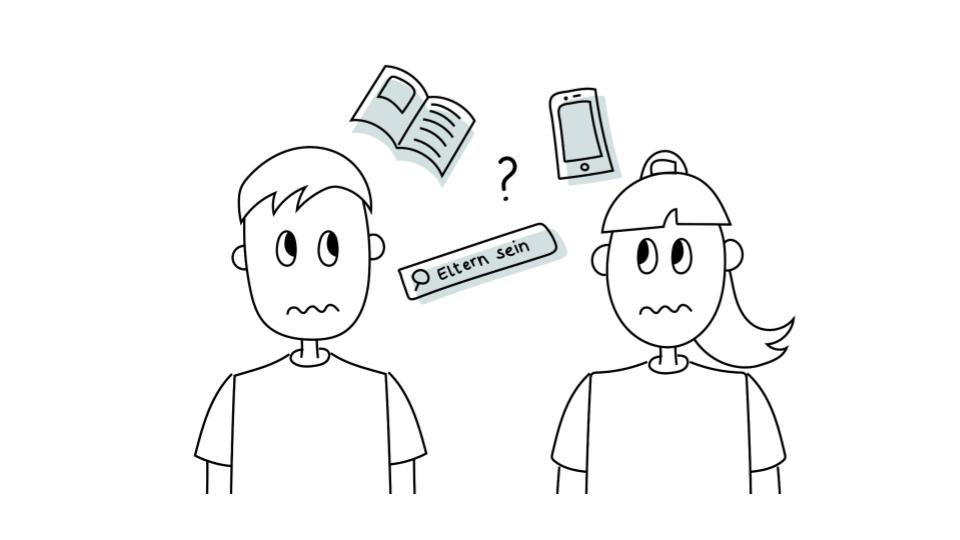
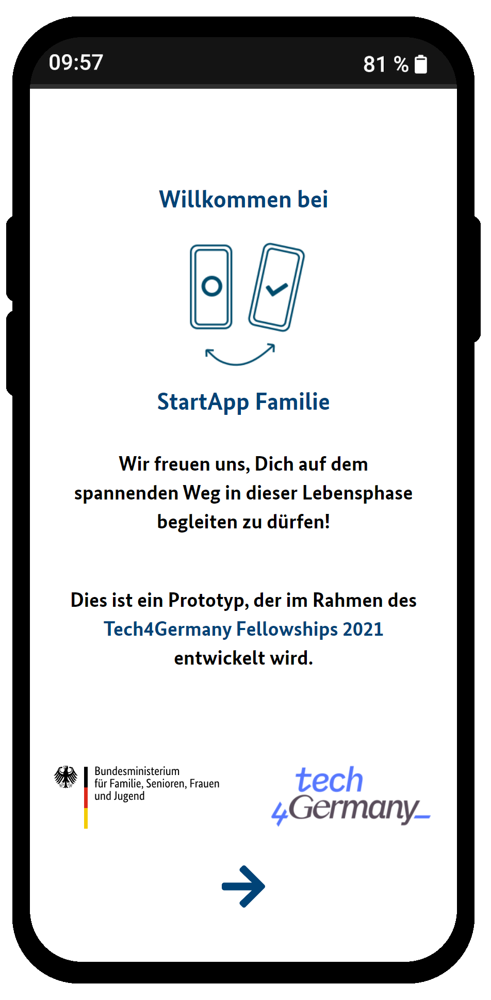
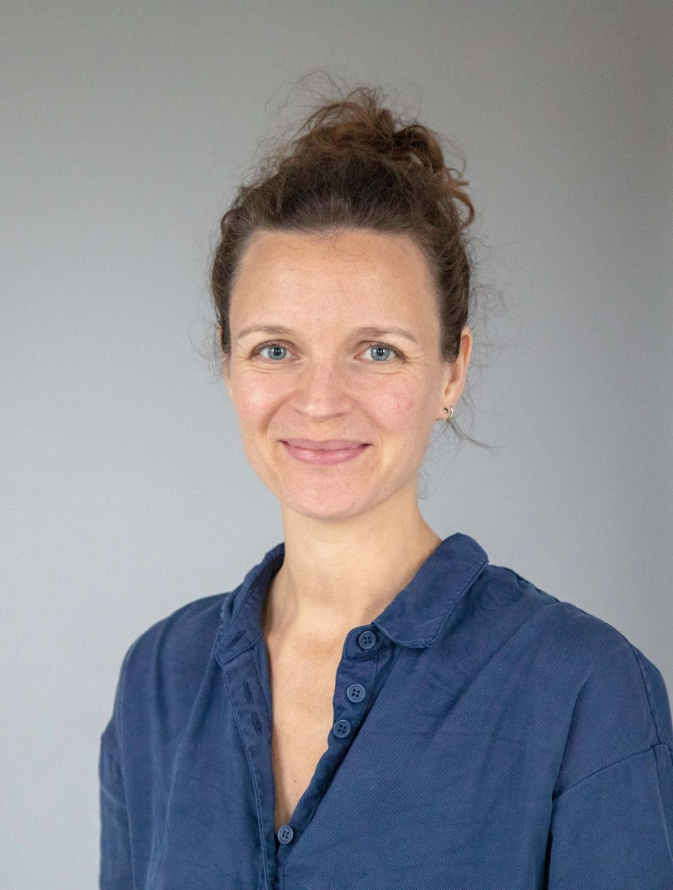

# **Partnerschaftliche Gleichstellung BMFSFJ 2021**

# StartApp Familie

Die „StartApp Familie“ ist ein Beitrag zur **_partnerschaftlichen Gleichstellung_** vor allem auf der Paar-Ebene. Die gemeinsam mit dem BMFSFJ entwickelte Web-App richtet sich an junge Erwachsene vor oder in der Familiengründung. Das Tool beinhaltet personalisierte vorausgefüllte To-dos und eine Sharing-Funktion, mit der die To-dos unter den Partner:innen fair und klischeefrei aufgeteilt werden können.

# +++ In Umsetzung +++

Die StartApp Familie befindet sich derzeit mit Unterstützung eines Work4Germany Fellows in der Umsetzung.

# Hintergrund & Herausforderung

Trotz gegenteiliger Überzeugung leben viele **_junge Erwachsene_** in ihren Partnerschaften, vor allem nach der Familiengründung, kulturell normative **_Rollenklischees_**. Das gefährdet nicht nur die persönliche und berufliche Entwicklung der Individuen und deren Zufriedenheit und Lebensqualität, sondern auch ihre wirtschaftliche Eigenständigkeit. Die **_langfristigen Folgen_** wie Armutsrisiken sind den Betroffenen oft nicht bewusst.

Um ein digitales Angebot zu entwickeln, das zu mehr **_Partnerschaftlichkeit_** beiträgt, hat sich das Referat 411„Partnerschaftliche Gleichstellungspolitik, Aufwertung sozialer Berufe“ vom BMFSFJ um Teilnahme am Tech4Germany-Fellowship beworben.

Das Angebot soll **_informierte und reflektierte Entscheidungen_** über die Rollenaufteilung in Partnerschaften zielgruppengerecht unterstützen. Außerdem war es wichtig, dass auch bereits bestehende Informationen und Entscheidungshilfen eingebunden und neu strukturiert werden.

# Ressourcen

### [Fallstudie](f1_BMFSFJ-2021-Fallstudie-Partnerschaftliche-Gleichstellung_end.pdf)

### [Prozesspapier](f2_BMFSFJ-2021-Prozesspapier-Partnerschaftliche-Gleichstellung.pdf)

### [Handlungsempfehlungen](f3_BMFSFJ-2021-Oeff.-Handlungsempfehlungen-Partnerschaftliche-Gleichstellung.pdf)

### [OnePager StartApp Familie](f4_OnePager_BMFSFJ_final.pdf)

### [GitHub (Code)](https://github.com/tech4germany/bmfsfj-partnerschaftliche-gleichstellung) 

# Links

### [Prototyp](https://dev.tech4germany.org/bmfsfj-partnerschaftliche-gleichstellung)

### [Aktuelles-Meldung](https://www.bmfsfj.de/bmfsfj/aktuelles/alle-meldungen/digital-talente-entwickeln-app-prototypen-fuer-mehr-partnerschaftlichkeit-186718)

### [Tweet-Collection](https://twitter.com/Jonathan4GER/timelines/1455830377516441604)

# Galerie                 

# Vorgehen & Erkenntnisse 

Die Herausforderung war am Anfang sehr offen und breit formuliert. Mit 10+ **_Expert:innen- _**und 40+ **_Nutzer:innen-_**Interviews wurden zunächst Potenziale eines digitalen Tools für verschiedene Zielgruppen identifiziert.

Dabei wurde deutlich, dass Paare meistens **_partnerschaftlich_** und **_gleichgestellt_** in die Beziehung starten, die **_Familiengründungsphase aber häufig einen Kipppunkt für die Partnerschaftlichkeit darstellt_**. Genau dann beginnen Wunsch und Wirklichkeit von Partner:innen auseinanderzuklaffen: die meisten Paare wünschen sich eine partnerschaftliche Aufteilung von Aufgaben rund um Familie, die wenigsten leben diese jedoch auch tatsächlich. Die Nutzer:innen-Interviews schärften diese Erkenntnis dahingehend, dass die Zielgruppe der jungen Erwachsenen an genau dieser **_Weichenstellung_** für das Thema Partnerschaftlichkeit besonders gut **_ansprechbar_** ist.

So entstand das Ziel, vor allem**_ junge Erwachsene_** darin zu unterstützen, ihre **_Wünsche_** nach mehr Partnerschaftlichkeit schon in der Zeit der Familiengründung **_zu leben. _**

# Lösung

Wir haben die **_„StartApp Familie“_** entwickelt, eine **_Web-App_**, die sich an alle richtet, denen eine **_Familiengründung_** oder -erweiterung bevorsteht. Sie bietet Orientierung, Informationen und praktische Unterstützung bei der Erledigung der anstehenden Aufgaben rund um Familie, Beruf, Geld und Bürokratie. Kernstück der Anwendung ist eine**_ personalisierte To-do-Liste_**, die…

… individuell die auf die Lebenssituation zugeschnittene Aufgaben aufführt,

… bestehende Angebote der Ministerien integriert,

… bei der Entscheidungsfindung unterstützt

und einfach hilft, alle Aufgaben im Blick zu behalten.

Das Besondere ist: Die StartApp Familie ist dank der **_Sharing-Funktion_** auch für **_Paare_** nutzbar. Hiermit trägt sie zur gemeinsamen Planung bei, schafft einen gleichen, einfachen Zugang zum Wissen und befördert eine **_klischeefreie Aufgabenteilung zwischen den Partner:innen._** 

## Personalisierte vorausgefüllte To-Do-Liste

Die Nutzer:innen bekommen nur die To-dos angezeigt, die für sie relevant sind. Dafür beantworten sie bei der Einführung wenige einfache Fragen und gelangen dann in ihre persönliche Übersicht der Module mit darin enthaltenen To-dos. 

### Video 

## Partnerschaftlichkeit im Mittelpunkt

Die Praxistipps für mehr Partnerschaftlichkeit in jedem To-do und die Sharing-Funktion („Einladung teilen“) sind besonders wichtig für das Konzept der „StartApp Familie“. So wird in dem Tool mit Selbstverständlichkeiten gearbeitet („nudging“).

# Wir empfehlen dem BMFSFJ das Projekt AGIL weiterzuführen – aus folgenden Gründen:

## 1 Neue Zielgruppe: Junge Erwachsenen vor/in der Familiengründung

Bisher gibt es wenig digitale Angebote vom BMFSFJ, die sich explizit an die jungen Erwachsenen vor/in der Familiengründung richten. Das viel genutzte [Familienportal](https://familienportal.de/) informiert sehr vollumfänglich, aber nicht zielgruppenspezifisch.**_ „StartApp Familie“_** richtet sich genau an diese Zielgruppe.

## 2 Bedarf der Bürger:innen nach Vereinfachung und Personalisierung der Informationen

Die Informationsangebote des BMFSFJ haben den Anspruch, alle Familienkonstellationen abzudecken, was gesamtgesellschaftlich richtig ist, es aber für Einzelpersonen sehr kompliziert macht. Die Bürger:innen haben den Bedarf zu wissen, was genau für sie gilt. Außerdem kann die **_„StartApp Familie“_ **in anderen Sprachen genutzt werden. Damit werden sprachliche und kulturelle Barrieren überwunden.

## 3 Aspekt der Partnerschaftlichkeit bei der Familiengründung

Die bisherigen Angebote richten sich in der Regel entweder an Männer oder an Frauen, adressieren aber kaum die Partner:innen zusammen als Paar. **_„StartApp Familie“_** setzt das Thema Partnerschaftlichkeit explizit als Schwerpunkt.

## 4 Sehr positives Feedback zum Prototypen 

Der Prototyp für **_„StartApp Familie“_** erfüllt die Erwartungen und deckt die Bedarfe der Nutzer:innen ab. Die Nutzer:innenzentrierung wurde durch ein iteratives Vorgehen und Tests mit der Zielgruppe gesichert.  

## 5 Großes Vertrauen in die Angebote vom BMFSFJ

Das BMFSFJ genießt ein großes Vertrauen der Bürger:innen.**_„StartApp Familie“ _**als Angebot des Ministeriums hat einen Vertrauensvorschuss im Vergleich zu kommerziellen Angeboten.

# Unsere Ergebnisse sind frei verfügbar

## Prozesspapier

Detailliertes Vorgehen und Ergebnisse des Projektteams

### [Download](f2_BMFSFJ-2021-Prozesspapier-Partnerschaftliche-Gleichstellung.pdf) 

## Handlungsempfehlungen

Empfehlungen an das BMFSFJ zur agilen Weiterführung des Projekts

### [Download](f3_BMFSFJ-2021-Oeff.-Handlungsempfehlungen-Partnerschaftliche-Gleichstellung.pdf) 

## Prototyp (Demo)

Funktionierender Prototyp „StartApp Familie“

### [Ausprobieren](https://dev.tech4germany.org/bmfsfj-partnerschaftliche-gleichstellung) 

## Code

Unsere Arbeitsergebnisse als Open Source auf GitHub

### [StartApp Familie auf GitHub](https://github.com/tech4germany/bmfsfj-partnerschaftliche-gleichstellung) 

# Das Team

Katja Anokhina \
Product Fellow \
[LinkedIn](https://www.linkedin.com/in/katja-anokhina)

Jonathan Schneider \
Engineering & Product Fellow \
[LinkedIn](https://www.linkedin.com/in/jonathanschneiderde/)

Sophia Grote \
Design Fellow \
[LinkedIn](https://www.linkedin.com/in/sophia-grote-83b811170/)

Malte Laukötter \
Engineering Fellow \
[LinkedIn](https://www.linkedin.com/in/malte-lauk%C3%B6tter/)

# Projektpartner:innen

Bundesministerium für Familie, Senioren, Frauen und Jugend

 \
**Dr. Kirsten Wendland \
**Referat 411, Referatsleiterin

 \
**Alexandra Wend \
**Referat 411, Referentin

 \
**Dr. Nikola Benke \
**Referat 411, Referentin

 \
**Ricarda Skirde \
**Referat 411, Praktikantin
