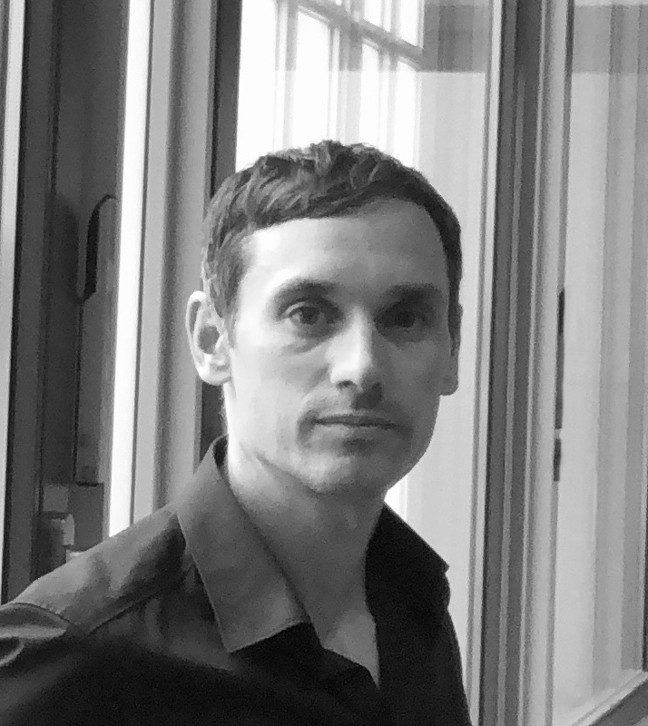

# Monitoring der Bundesbeteiligung BMF 2022

## Lernen aus Erfahrungen: Wenn Projekte mal nicht so verlaufen, wie wir es vorsehen und uns für die Teilnehmenden wünschen.

Dieser Beitrag ist nicht direkt vom Projektteam, sondern ausnahmsweise vom Tech4Germany Programm-Team verfasst worden. Wir fokussieren uns dabei ganz besonders auf den Transformationsbereich **Haltung**. 

Der Fokus für **Tech4Germany** liegt auf dem Prozess der Zusammenarbeit, den Herausforderungen und den daraus resultierenden Learnings. **Transparenz** und offene Kommunikation wurden auch in dem folgenden Projekt als Schlüsselelemente für eine erfolgreiche Zusammenarbeit identifiziert. Auch deswegen möchten wir diese ganz konkrete und herausfordernde Erfahrung sichtbar machen.

###  Das Projekt

Der Bund ist an mehr als hundert Unternehmen unmittelbar beteiligt, deren Beteiligungsführungen in vierzehn Ressorts angesiedelt sind. Dabei sind die Unternehmensbeteiligungen des Bundes nicht nur an enge rechtliche Voraussetzungen geknüpft, sondern der Bundesregierung obliegen auch verschiedene Berichtspflichten gegenüber dem Deutschen Bundestag sowie der Öffentlichkeit. Mithilfe dieses Projektes sollte ein Konzept für ein Software-System entwickelt werden, das die tägliche Beteiligungsführung digitalisiert, die Qualität der Berichtsdaten erhöht, einheitliche Datenbestände sicherstellt und das Berichtswesen professionalisiert.

###  Der Tech4Germany Prozess
 
Typischerweise durchläuft ein Tech4Germany Team aus Fellows und Projektpartner:innen den folgenden Prozess bei Tech4Germany.  
 

1. **Wer**: Unsere vier Fellows aus den Bereichen Product, Design und Engineering sowie unsere Projektpartner:innen aus dem Bundesministerium der Finanzen \

2. Die Teams starten im **Problemraum**: Hier versuchen sie zu verstehen, welches Problem überhaupt gelöst werden soll. Dafür führen sie Nutzerinterviews durch und destillieren Bedürfnisse und Erkenntnisse
3. Im **Lösungsraum** experimentiert das Team mit verschiedenen Lösungsansätzen, testet Ideen immer wieder mit Nutzer:innen und entwickelt so Lösungen weiter. 
4. **Was: **Zum Schluss gibt es einen Prototypen, der eine mögliche Lösung erlebbar macht. 

Wenn man diesen Prozess als Grundlage nimmt, dann ist das Projekt „Monitoring der Bundesbeteiligung“ im Sinne des angestrebten **WIEs gescheitert. **Das Team konnte den Tech4Germany Prozess nicht gemeinsam vom Problem- bis Lösungsraums durchlaufen und zu einem geteilten Ergebnis (WAS) kommen. \

**## Was ist auf der WIE-Ebene der Zusammenarbeit passiert?**

Um diese WIE-Ebene aufzuarbeiten, helfen 2 Hypothesen, mit denen wir in die Fellowship-Programm-Planung gegangen sind und bei denen wir mittlerweile viel dazu gelernt haben. 

** ##**Hypothese 1**: „Alle Projektteilnehmer:innen sind zum Projektstart auf einem Stand und laufen an einer gemeinsamen Startlinie los.“** \

Konkret haben wir erwartet, dass alle Teams spätestens nach dem Bewerbungsprozess und unserer Einführungswoche auf einem ähnlichen Stand sind und so mit einem gemeinsamen Verständnis Tech4Germany im August 2022 starten würden. Zwischen der Suche der Fellows und Projekten bis zu diesem offiziellen Startschuss vergehen gut sechs Monate. Diese Zeit haben wir 2022 zum Beispiel für die Durchführung von methodisches Onboardings, Vorbereitungsworkshops und ähnlichen Formaten genutzt. Eigentlich, um sicherzustellen, dass alle Teams unter ähnlichen Bedingungen und Verständnis loslegen können. 

Das Fellowteam hat während der inhaltlichen Arbeit im Fellowship jedoch schnell festgestellt, dass es unterschiedliche Startpunkte der beteiligten Personen gibt, z.B. im **1)** **Projektfortschritt** oder bei der **2) methodischen Ausrichtung.**

1) **Projektfortschritt**: Während Fellows zu Beginn gemeinsam mit dem Erkunden (und Erkennen) im **Problemraum **starteten, agierten viele der Projektpartner:innen bereits im **Lösungsraum**, mit klaren Lösungsideen oder sogar mit konkret ausformulierten Feature-Beschreibungen.

2) **Wie entscheiden wir, was entwickelt wird? ** Noch wichtiger als zu erkennen, wo das Projekt gerade steht, ist festzustellen, wie das Team eigentlich dorthin gelangt ist. Diese gemeinsame Reflexion erfordert viel Kommunikation. Diese Gespräche sind essenziell, um zu entscheiden, welche Routen weitergegangen werden (Probleme verifiziert) und welche geändert werden können (Probleme falsifiziert). 

 
Die Frage, die das Team am meisten beschäftigt hat, war: Wie schafft es das Team, Nutzerzentriertheit mit den Rahmenbedingungen der Verwaltung möglichst nahtlos zu verbinden?

##**Learning aus Hypothese 1 ** 

Ein **Learning** hierbei ist es, die Gespräche im **Problemraum** ausführlich und ohne Zeitdruck zu führen. Später kann so bei den Iterationsschleifen der Lösung Zeit gespart werden, da frühzeitig Risiken aufgedeckt und diese bearbeitet werden können.  
 
Ein weiteres **Learning** ergibt sich aus einem Luxusproblem. Die Motivation und das Engagement der Projektpartner:innen wurde über die Jahre immer größer. Damit steigt die Notwendigkeit, den **Projektverlauf** des Programms so zu **verkürzen**, dass gemeinsam an der gleichen Startlinie im August losgelegt werden kann. 

##**Hypothese 2**: „Alle Stakeholder verstehen das Gleiche unter den gleichen Worten“ 
 
Wir haben angenommen, wenn wir als Fellowship-Team, Projektpartner:innen und Fellows miteinander sprechen und die gleichen Worte ganz natürlich verwenden, dass wir auch dieselben Dinge darunter verstehen.  
 
Um als Fellow-Team mit den Projektpartnern erfolgreich zu sein, ist es sehr wichtig, dass eine gemeinsame Sprache gesprochen wird. Bei Begriffen, wie Mock-Ups, Designs oder Wireframes mussten alle im Projektteam erstmal ein gemeinsames Verständnis finden. Dazu gehört auch, ein gemeinsames Verständnis für die aus den Begriffen abgeleitete Bedeutung für das Projekt.

 
Viele Begriffe, wie „nutzerzentriert”, „iterativ”, „ergebnisoffen” sind seit Start des 1. Fellowship-Jahrgangs in vielen Ministerien im täglichen Sprachgebrauch. Ihre Bedeutung ist aber nicht immer klar.

Beispielsweise kann ein **Prototyp** in verschiedenen Projektphasen erstellt werden, hat jedoch jeweils eine andere Funktion. Beim Erkunden und Erkennen (Problemraum) hilft ein Prototyp, bestimmte Probleme sichtbar zu machen. Zum Beispiel durch User Journeys. Beim Entwerfen oder Erproben einer Lösung (Lösungsraum) stellt ein Prototyp aber etwas ganz anderes dar. Viele sehen dann in einem Prototyp eine Blaupause für ein fertiges Produkt. Um einen ersten Aufschlag in Richtung Produkt zu machen, sind Mock-ups sehr hilfreich. Diese hat das Team genutzt, um die technische Logik zu erarbeiten und Anforderungen an eine zukünftige Software zu sammeln. Das Ergebnis war also eher ein Umsetzungsprototyp, auf den die Implementierung folgen könnte. 

##**Learning aus Hypothese 2**

Hier ist das Lernfeld klar: **Begriffe präzisieren.** Wir leisten keine **Grundlagenarbeit** mehr, sondern müssen unsere Begriffe **ausdifferenzieren**. Also genauer miteinander über zentrale Verständnisse sprechen.

##**Fazit: Tech4Germany im Wandel**

Tech4Germany bleibt ein dynamisches Fellowship, das sich jedes Jahr verändert und anhand neuer Erkenntnisse angepasst wird. Zu diesen Erkenntnissen zählt auch Gelerntes aus diesem Projekt. In diesem Sinne ist das Tech4Germany Fellowship jedes Jahr aufs neue eine Art „Umsetzungsprototyp“.  
 
Die hier dargestellten Herausforderungen sind nur einige der Gründe, warum wir uns mit Tech4Germany 2023 Zeit zur Weiterentwicklung nehmen. Wir nutzen das Jahr und lassen Tech4Germany durch einen ebenso ergebnisoffenen und iterativen Prozess laufen, wie wir es aus unseren Fellowship-Projekten kennen. Dadurch werden wir Tech4Germany zielgerichtet und wirksam an die sich verändernden Rahmenbedingungen der öffentlichen Verwaltung anpassen. Alle Hintergründe gibt es in unserem [Blog](https://digitalservice.bund.de/blog/tech4germany-2023-weiterentwicklung).

### Team

|                                      |                                       |
|:--------------------------------------:|:---------------------------------------:|
| {:class="profile-pic"} **Fabian Ulmer** Product Fellow | {:class="profile-pic"} **Svenja Schäfer** Product Fellow |
| {:class="profile-pic"} **Christian Steiner** Design Fellow | {:class="profile-pic"} **Christian Bernhard** Engineering Fellow |

